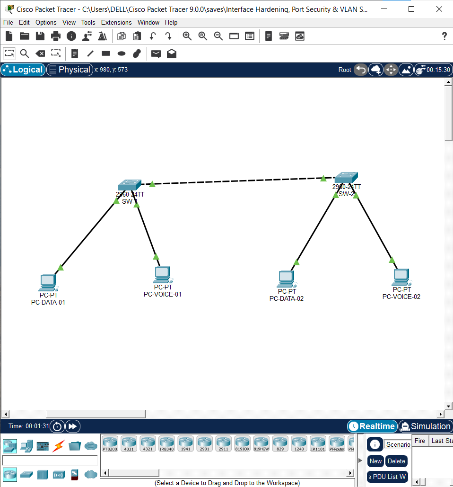
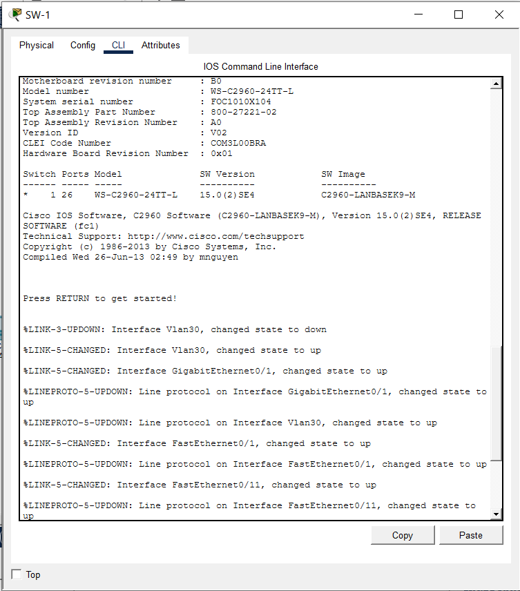
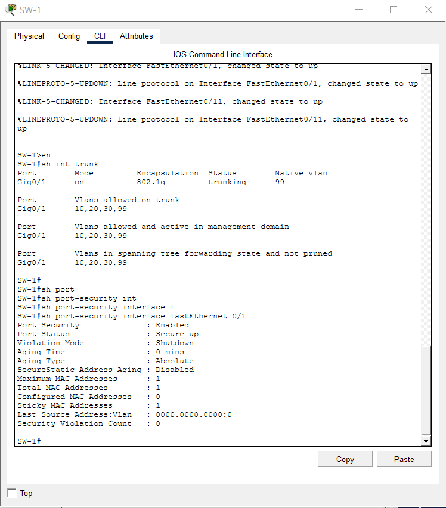
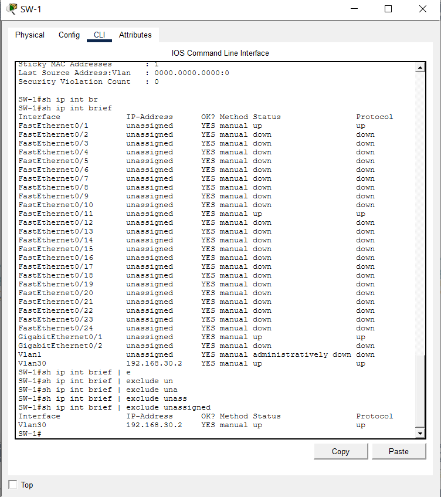
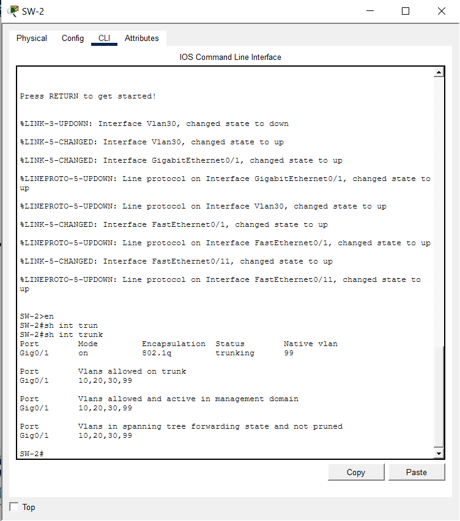
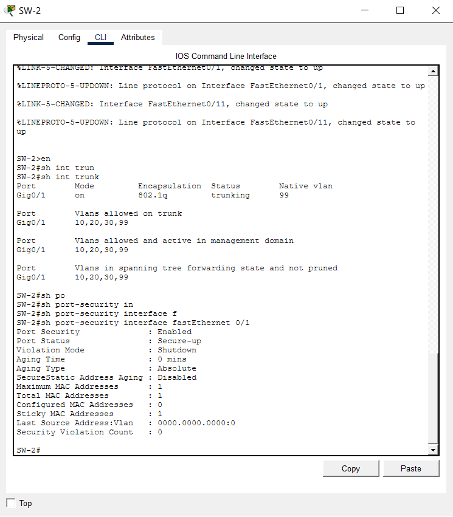
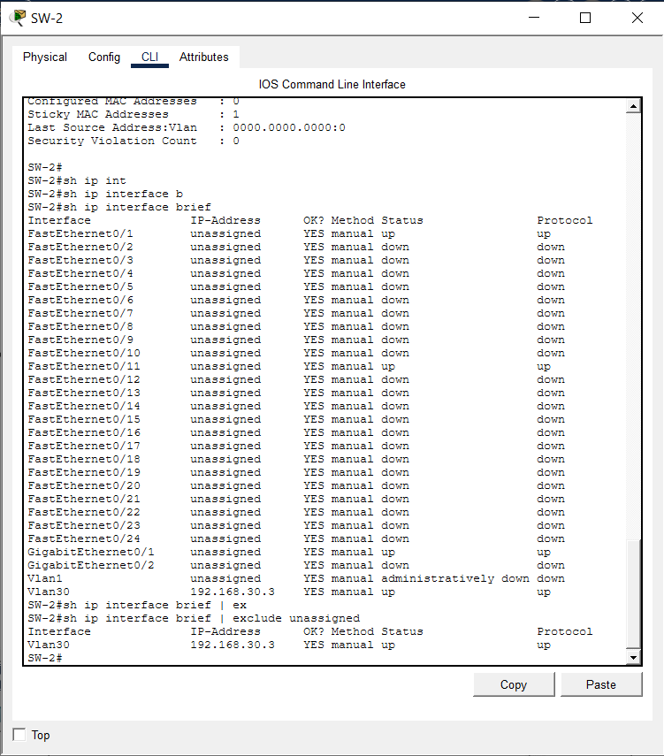

# LAB 02: Interface Hardening, Port Security & VLAN Segmentation Architecture

## 1. Technical Executive Summary & Domain Overview

Where Lab 01 hardened the *management* control plane (who can administer a device, and how), Lab 02 hardens the **data plane at the physical edge** — the access ports where end-user hosts physically connect. This is a structurally different attack surface: an adversary here doesn't need valid credentials at all. Physical or logical access to a single unused switchport is sufficient to attempt VLAN hopping, CAM (Content Addressable Memory) table exhaustion, rogue-device insertion, or unauthorized trunk negotiation — none of which require passing an authentication prompt.

This lab documents the hardening of a two-switch access-layer fabric — **SW-1** and **SW-2**, both Cisco Catalyst 2960-24TT switches (IOS 15.0(2)SE4, `C2960-LANBASEK9-M` image) — interconnected via a dedicated 802.1Q trunk, each serving one data host and one voice host at the access edge for the organization **NovaTech Solutions**.

**Threat models explicitly mitigated by this hardening pass:**

| Threat Vector | Unhardened Exposure | Mitigation Applied |
|---|---|---|
| VLAN hopping via double-tagging (802.1Q/802.1Q nested tag attack) | Native VLAN on trunk defaults to VLAN 1, the same VLAN most switches use unencrypted/untagged by default | Native VLAN relocated to a dedicated, non-routed VLAN 99 (`Native_Trunk`) — decoupling the trunk's untagged VLAN from any VLAN carrying live traffic |
| MAC flooding / CAM table overflow forcing a switch into fail-open hub mode | No cap on learned MAC addresses per port | `switchport port-security maximum 1` — hard ceiling of one learned MAC per access port |
| Unauthorized device substitution (unplug authorized host, plug in rogue device) | Any device plugged into an access port is forwarded without validation | `switchport port-security mac-address sticky` + `violation shutdown` — the first-learned MAC is locked in; any second/different MAC trips a hard `err-disable` shutdown |
| Silent use of dormant/unused physical ports as an entry point | Unused ports left in default VLAN 1, in `dynamic auto` trunking mode, administratively up | `interface range Fa0/2-24, Gi0/2` forced into `switchport mode access`, parked on an unused VLAN 999, and administratively `shutdown` |
| Rogue trunk negotiation (Dynamic Trunking Protocol abuse) | A host sending DTP Desirable frames could negotiate a live 802.1Q trunk on what should be an access port | Every access port hard-set with `switchport mode access` (no `dynamic auto/desirable` left in play) |

---

## 2. Infrastructure Topology & Subnet Matrix

**Subnet Parameters (Management Plane — VLAN 30):**

| Parameter | Value |
|---|---|
| Network Address | `192.168.30.0` |
| Subnet Mask | `255.255.255.0` (`/24`) |
| CIDR Notation | `192.168.30.0/24` |

**VLAN Segmentation Matrix:**

| VLAN ID | Name | Purpose | Carried on Trunk? |
|---|---|---|---|
| 10 | `Voice` | Voice endpoint traffic segmentation | Yes |
| 20 | `Data` | End-user data host traffic | Yes |
| 30 | `Management` | Switch SVI / administrative reachability | Yes |
| 99 | `Native_Trunk` | Dedicated, isolated native (untagged) VLAN for the trunk link | Yes (untagged) |
| 999 | *(unnamed / blackhole)* | Parking VLAN for all administratively disabled, unused ports | No — access-only, disabled ports |

**Device Inventory & Addressing:**

| Device | Hardware / IOS | Role | Management SVI |
|---|---|---|---|
| SW-1 | Cisco Catalyst WS-C2960-24TT-L, IOS 15.0(2)SE4 | Access-layer switch, west segment | `Vlan30` → `192.168.30.2/24` |
| SW-2 | Cisco Catalyst WS-C2960-24TT-L, IOS 15.0(2)SE4 | Access-layer switch, east segment | `Vlan30` → `192.168.30.3/24` |
| PC-DATA-01 | End host | Data VLAN endpoint | Fa0/1 on SW-1 |
| PC-VOICE-01 | End host | Voice VLAN endpoint | Fa0/11 on SW-1 |
| PC-DATA-02 | End host | Data VLAN endpoint | Fa0/1 on SW-2 |
| PC-VOICE-02 | End host | Voice VLAN endpoint | Fa0/11 on SW-2 |

SW-1 and SW-2 are interconnected via `GigabitEthernet0/1` on each device, configured as an 802.1Q trunk (dashed line in the topology diagram — standard Packet Tracer notation for a trunk link, as distinct from the solid access-link lines running to each PC).



---

## 3. Logical Traffic Flow & Structural Architecture Map

```text
    ┌───────────────────────┐                          ┌───────────────────────┐
    │   PC-DATA-01 (VLAN 20) │                          │   PC-DATA-02 (VLAN 20) │
    └────────────┬──────────┘                          └────────────┬──────────┘
                  │ Fa0/1 (access, VLAN 20)                          │ Fa0/1 (access, VLAN 20)
    ┌────────────┴──────────┐                          ┌────────────┴──────────┐
    │   PC-VOICE-01 (VLAN10)│                          │   PC-VOICE-02 (VLAN10)│
    └────────────┬──────────┘                          └────────────┬──────────┘
                  │ Fa0/11                                           │ Fa0/11
    ┌─────────────┴──────────────────┐          ┌─────────────────┴────────────┐
    │            SW-1                 │          │            SW-2               │
    │  Port Security: max 1 / sticky  │          │  Port Security: max 1 / sticky│
    │  Violation Mode: shutdown       │          │  Violation Mode: shutdown     │
    │  Vlan30 SVI: 192.168.30.2       │          │  Vlan30 SVI: 192.168.30.3     │
    │  Fa0/2-24, Gi0/2: VLAN 999,     │          │  Fa0/2-24, Gi0/2: VLAN 999,   │
    │  admin shutdown (blackholed)    │          │  admin shutdown (blackholed)  │
    └───────────────┬──────────────────┘          └───────────────┬────────────┘
                    │ Gi0/1 (802.1Q Trunk)                          │ Gi0/1 (802.1Q Trunk)
                    │ Native VLAN: 99 | Allowed: 10,20,30,99        │
                    └───────────────────── TRUNK LINK ──────────────┘
```

### Detailed Phase Analysis

**Phase 1 — Frame Origination at the Access Edge:** When `PC-DATA-01` transmits, the frame leaves the host **untagged** (standard host NIC behavior — end hosts do not natively speak 802.1Q). It arrives at SW-1's `FastEthernet0/1`, which is hard-configured with `switchport mode access` and `switchport access vlan 20`. The switch — not the host — is responsible for tagging: internally, the frame is associated with VLAN 20 the instant it crosses the ingress boundary of that access port. The host never needs, and is never given, the ability to specify its own VLAN membership.

**Phase 2 — Port Security Enforcement (Ingress Gate):** Before the frame is even forwarded, `switchport port-security` evaluates the source MAC address against the port's secure address table. Because `switchport port-security mac-address sticky` is configured with `maximum 1`, the **first** MAC address seen on that port is dynamically learned and converted into a sticky secure entry (persisted into the running-configuration). Any subsequent frame arriving on `Fa0/1` from a **different** source MAC — indicating a device swap, a hub/switch inserted to multiplex multiple hosts onto the port, or a spoofing attempt — immediately triggers `violation shutdown`: the port is forced into `err-disabled` state and stops forwarding entirely, requiring manual (or `errdisable recovery`-timer-based) administrative re-enablement.

**Phase 3 — Uplink to the Trunk (Gi0/1):** Once validated, VLAN-20-tagged data-plane traffic destined off-switch is forwarded toward `GigabitEthernet0/1`. This interface is `switchport mode trunk` with `switchport trunk encapsulation dot1q` and an explicit allowed-VLAN list (`10,20,30,99`) — meaning **only** these four VLANs are permitted to traverse the link; any other VLAN ID present in the switch's VLAN database (or crafted by an attacker) is implicitly pruned at this boundary regardless of whether it exists elsewhere in the switch's configuration.

**Phase 4 — Native VLAN Handling (Critical Security Boundary):** The trunk's native VLAN is explicitly set to `99` (`switchport trunk native vlan 99`) rather than being left at the factory default of VLAN 1. This single line is the direct mitigation for the classic **802.1Q double-tagging VLAN hopping attack**: in that attack, a malicious host crafts a frame with two stacked VLAN tags — an outer tag matching the trunk's native VLAN (which gets stripped, untagged, by the first switch) and an inner tag for the attacker's target VLAN (which survives and is forwarded by the second switch as if legitimate). By relocating the native VLAN to `99` — a VLAN carrying no live host traffic and used *only* as the trunk's untagged carrier — even a successful double-tag craft only lands the attacker in an empty, purpose-built isolation VLAN rather than the Data, Voice, or Management VLANs.

**Phase 5 — Delivery to SW-2 and De-encapsulation:** SW-2 receives the trunk frame on its own `Gi0/1`, reads the 802.1Q tag, and — because its VLAN database, allowed-VLAN list, and native VLAN configuration are **symmetrically mirrored** to SW-1's — correctly re-associates the frame with VLAN 20 before forwarding it out the appropriate access port toward `PC-DATA-02`. This symmetry is not incidental; a trunk with mismatched native VLANs on either end is itself a well-documented misconfiguration vector (CDP will flag it as a "native VLAN mismatch" and it silently creates a VLAN leak), so the identical `native vlan 99` / `allowed vlan 10,20,30,99` statements on both switches are a deliberate, verified-matching control.

---

## 4. Engineering Implementation Analysis & Threat Mitigation

### a) VLAN Segmentation & Trunk Boundary Hardening

```text
vlan 10   name Voice
vlan 20   name Data
vlan 30   name Management
vlan 99   name Native_Trunk

interface GigabitEthernet0/1
 switchport trunk encapsulation dot1q
 switchport trunk native vlan 99
 switchport trunk allowed vlan 10,20,30,99
 switchport mode trunk
```

Explicitly forcing `switchport trunk encapsulation dot1q` (rather than allowing IOS to auto-negotiate encapsulation via ISL/DTP) removes an entire negotiation phase from the link bring-up process — there is no ambiguity for an attacker to exploit by injecting negotiation frames. The `switchport trunk allowed vlan` statement functions as a positive allow-list rather than a default-permit-all trunk, meaning VLAN 999 (the unused-port parking VLAN) is **structurally incapable** of crossing the inter-switch link even if a misconfigured or compromised access port were somehow associated with it — the trunk simply will not carry it.

**Engineering observation for future hardening:** `switchport mode trunk` is applied, but `switchport nonegotiate` is **not** present in either running-configuration. Without `nonegotiate`, the port still processes incoming DTP frames even though it won't itself initiate negotiation — a fully airtight configuration would add `switchport nonegotiate` to explicitly disable DTP frame processing on the trunk interface entirely. This is a recommended follow-up hardening item, not a currently exploited gap, since the port is already hard-set to `trunk` mode rather than a negotiable `dynamic` mode.

### b) Port Security & Physical Endpoint Access Control

```text
interface FastEthernet0/1
 switchport mode access
 switchport access vlan 20
 switchport port-security
 switchport port-security maximum 1
 switchport port-security violation shutdown
 switchport port-security mac-address sticky
```

The `sticky` learning mode is the architecturally correct choice over static manual MAC entry here: it converts the *first dynamically learned* MAC address into a permanent, running-config-persisted secure entry without requiring the administrator to pre-know and hand-type every end-host's MAC address in advance — while still delivering the same enforcement outcome as a fully static configuration once that first learn event occurs. `violation shutdown` (as opposed to the softer `protect` or `restrict` modes) was selected deliberately: `protect` silently drops offending frames with no logging, and `restrict` drops and logs but leaves the port live — both allow a sustained attack to continue indefinitely with no operational signal. `shutdown` mode instead forces the port into `err-disabled` state on the very first violation, converting what would otherwise be a silent security event into an unmissable operational outage that demands administrative attention — trading availability for certainty of detection, which is the correct trade-off on a locked-down access edge.

**Verified operational state** (`show port-security interface FastEthernet0/1`, identical on both switches):

```text
Port Security              : Enabled
Port Status                : Secure-up
Violation Mode             : Shutdown
Aging Time                 : 0 mins
Aging Type                 : Absolute
SecureStatic Address Aging : Disabled
Maximum MAC Addresses      : 1
Total MAC Addresses        : 1
Configured MAC Addresses   : 0
Sticky MAC Addresses       : 1
Security Violation Count   : 0
```

The `Sticky MAC Addresses: 1` / `Configured MAC Addresses: 0` pairing confirms the security entry was populated dynamically via sticky learning rather than manually typed — exactly matching the configuration intent. `Security Violation Count: 0` confirms the port has not yet been tested against an actual violation event at the time of capture.

### c) Unused Interface Hardening (Blackhole VLAN Strategy)

```text
interface range FastEthernet0/2 - 24, GigabitEthernet0/2
 switchport mode access
 switchport access vlan 999
 shutdown
```

This block addresses the single most common real-world access-layer weakness: switches are shipped, and frequently remain, with every unused port active on VLAN 1 in `dynamic auto` trunking mode — meaning an attacker with even brief physical access to an empty conference room or unused wall jack can plug in, potentially negotiate a trunk via DTP, and gain direct Layer 2 visibility into whatever VLAN 1 carries. This configuration closes that gap with two independent, stacked controls rather than relying on either alone: **(1)** every unused port is administratively `shutdown`, meaning it will not forward a single frame regardless of what's plugged in, and **(2)** *even if* a future administrator re-enables a port without reviewing its full configuration, it is pre-parked on VLAN 999 — a VLAN not present in any `switchport trunk allowed vlan` statement and carrying no legitimate traffic — rather than defaulting back to VLAN 1. This is defense-in-depth applied at the interface level: the shutdown is the primary control, and the blackhole VLAN assignment is the fallback control that activates automatically if the primary control is ever accidentally reversed.

---

## 5. Deployment Configurations & Scripts

### 5.1 Access-Layer Switch SW-1

📂 **Local Repository Link:** [View Raw SW-1 Script File](./Lab-02-SW1-Running-Config.txt)

```cisco
hostname SW1
!
vlan 10
 name Voice
!
vlan 20
 name Data
!
vlan 30
 name Management
!
vlan 99
 name Native_Trunk
!
interface FastEthernet0/1
 switchport mode access
 switchport access vlan 20
 switchport port-security
 switchport port-security maximum 1
 switchport port-security violation shutdown
 switchport port-security mac-address sticky
!
interface GigabitEthernet0/1
 description *** TRUNK LINK TO SW2 ***
 switchport trunk encapsulation dot1q
 switchport trunk native vlan 99
 switchport trunk allowed vlan 10,20,30,99
 switchport mode trunk
!
interface Vlan30
 description *** SW1 MANAGEMENT SVI ***
 ip address 192.168.30.2 255.255.255.0
 no shutdown
!
! --- HARDENING UNUSED INTERFACES ---
interface range FastEthernet0/2 - 24, GigabitEthernet0/2
 switchport mode access
 switchport access vlan 999
 shutdown
!
end
```





### 5.2 Access-Layer Switch SW-2

📂 **Local Repository Link:** [View Raw SW-2 Script File](./Lab-02-SW2-Running-Config.txt)

```cisco
hostname SW2
!
vlan 10
 name Voice
!
vlan 20
 name Data
!
vlan 30
 name Management
!
vlan 99
 name Native_Trunk
!
interface FastEthernet0/1
 switchport mode access
 switchport access vlan 20
 switchport port-security
 switchport port-security maximum 1
 switchport port-security violation shutdown
 switchport port-security mac-address sticky
!
interface GigabitEthernet0/1
 description *** TRUNK LINK TO SW1 ***
 switchport trunk encapsulation dot1q
 switchport trunk native vlan 99
 switchport trunk allowed vlan 10,20,30,99
 switchport mode trunk
!
interface Vlan30
 description *** SW2 MANAGEMENT SVI ***
 ip address 192.168.30.3 255.255.255.0
 no shutdown
!
! --- HARDENING UNUSED INTERFACES ---
interface range FastEthernet0/2 - 24, GigabitEthernet0/2
 switchport mode access
 switchport access vlan 999
 shutdown
!
end
```





---

## 6. Verification Protocols & Operational Diagnostics

### Test Phase 1: Trunk Negotiation & VLAN Allow-List Verification

**Objective:** Confirm the inter-switch link is operating as a true 802.1Q trunk with the correct native VLAN and allowed-VLAN set on both ends.

**Methodology:** `show interface trunk` on each switch, privileged EXEC mode.

```text
SW-1#sh int trunk
Port      Mode   Encapsulation  Status      Native vlan
Gig0/1    on     802.1q         trunking    99

Port      Vlans allowed on trunk
Gig0/1    10,20,30,99

Port      Vlans allowed and active in management domain
Gig0/1    10,20,30,99

Port      Vlans in spanning tree forwarding state and not pruned
Gig0/1    10,20,30,99
```

```text
SW-2#sh int trunk
Port      Mode   Encapsulation  Status      Native vlan
Gig0/1    on     802.1q         trunking    99

Port      Vlans allowed on trunk
Gig0/1    10,20,30,99
```

**Analysis:** Both switches report an **identical** native VLAN (99) and allowed-VLAN set, confirming no native VLAN mismatch exists across the link — a condition that, if present, would generate CDP native-VLAN-mismatch syslog warnings and create an unintended Layer 2 leak path.

### Test Phase 2: Port Security State & Sticky MAC Verification

**Objective:** Confirm port security is active, in enforcing mode, and has successfully converted a dynamically learned MAC into a sticky secure entry on the live access port.

```text
SW-1#sh port-security interface fastEthernet 0/1
Port Security              : Enabled
Port Status                : Secure-up
Violation Mode             : Shutdown
Maximum MAC Addresses      : 1
Total MAC Addresses        : 1
Sticky MAC Addresses       : 1
Security Violation Count   : 0
```

**Analysis:** `Port Status: Secure-up` confirms the port is actively enforcing security while remaining in a forwarding state (as opposed to `Secure-shutdown`, which would indicate a violation has already occurred). A `Security Violation Count` of `0` on both switches confirms this is the clean, pre-violation baseline state — establishing the control is armed but not yet triggered.

### Test Phase 3: Management SVI Reachability Verification

**Objective:** Confirm each switch's Layer 3 management interface (VLAN 30) is correctly addressed and operationally up, independent of the VLAN 999-parked unused ports.

```text
SW-1#sh ip int brief
Interface        IP-Address       Status                  Protocol
FastEthernet0/1   unassigned       up                      up
FastEthernet0/11  unassigned       up                      up
Vlan1             unassigned       administratively down   down
Vlan30            192.168.30.2     up                      up
```

```text
SW-2#sh ip int brief
Interface        IP-Address       Status                  Protocol
FastEthernet0/1   unassigned       up                      up
FastEthernet0/11  unassigned       up                      up
Vlan1             unassigned       administratively down   down
Vlan30            192.168.30.3     up                      up
```

**Analysis:** `Vlan1` correctly shows `administratively down` — confirming the default VLAN carries no active management interface and cannot be used as a fallback administrative path. `Vlan30` is `up/up` with the correct addressing on both switches, confirming the management plane is fully reachable through the intended VLAN only.

**⚠ Engineering finding — flagged for reconciliation:** Both switches show `FastEthernet0/11` in an `up/up` operational state. Per the supplied running-configuration text, `Fa0/11` falls within the `interface range FastEthernet0/2 - 24` block that is configured `shutdown` and parked on VLAN 999. Since Fa0/11 is the physical port serving `PC-VOICE-01`/`PC-VOICE-02` in the topology, this indicates the exported configuration text is **missing an explicit interface block for Fa0/11** (almost certainly a voice-VLAN access-port configuration mapping it to VLAN 10, which would exempt it from the blanket unused-port range). This is not a live security gap — the port is clearly serving its intended voice endpoint — but the running-config export should be re-pulled to capture the missing `interface FastEthernet0/11` stanza so the documented configuration fully matches the verified device state.

### Test Phase 4: Hardware & Software Baseline Verification

**Objective:** Confirm both switches are running matched hardware and IOS versions, establishing a consistent security baseline across the fabric.

```text
SW-1#sh version
Model number          : WS-C2960-24TT-L
Cisco IOS Software, C2960 Software (C2960-LANBASEK9-M), Version 15.0(2)SE4
```

**Analysis:** Matched hardware revisions and an identical IOS feature set (`LANBASEK9`) across SW-1 and SW-2 confirms both switches support the full command set used in this configuration (`port-security`, `dot1q` trunking, `switchport` VLAN controls) without any feature-license asymmetry between the two nodes.
