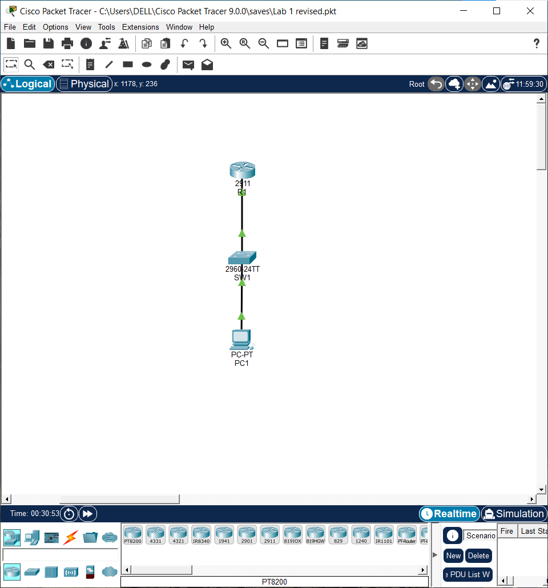

```markdown
# LAB 01: Control Plane Hardening & Secure Remote Management Architecture

## 1. Technical Executive Summary & Domain Overview
The control and management planes of network infrastructure represent the core administrative attack surface of an enterprise. In default factory configurations, devices like Cisco ISR routers and Catalyst switches operate under insecure operational baselines—credentials are often unencrypted, plaintext protocols like Telnet are permitted, and terminal parameters lack protection against raw brute-force discovery. 

The primary objective of this deployment is to transform a standard topology into a hardened corporate branch environment using a Cisco 2911 Integrated Services Router (ISR) and a Cisco 2960 Catalyst Switch. This architecture implements cryptographic remote management enforcements, robust data-at-rest credential protection, strict timeout boundaries, and customized security notices. By introducing these layers, we break standard interception techniques (such as packet sniffing, credential harvesting, and session hijacking) and align the infrastructure with regulatory security compliance frameworks.

---

## 2. Infrastructure Topology & Subnet Matrix
Administrative network access in this lab is strictly bound to an isolated, software-defined management workspace. Restricting access to a specific subnetwork ensures that management data blocks do not mingle with standard data loops, establishing a fundamental security boundary.

* **Management Subnet Boundary:** `192.168.1.0/24`
* **Router R1 Gateway Interface (Gi0/0):** `192.168.1.1`
* **Switch SW1 Management SVI (Vlan1):** `192.168.1.2`
* **Administrative Host Terminal (PC1):** `192.168.1.10`
* **Segment Subnet Mask:** `255.255.255.0`



---

## 3. Logical Traffic Flow & Structural Architecture Map

The reference diagram below delineates the routing vectors, interface boundaries, and socket enforcements utilized during an active administrative management session:

```text
    ┌────────────────────────────────────────────────────────┐
    │              ADMINISTRATIVE OPERATION HOST (PC1)       │
    │              IP Address Assignment: 192.168.1.10      │
    └───────────────────────────┬────────────────────────────┘
                                │
                   [Traffic Parameters Injected]
                   ► Layer 3 Protocol: ICMP Echo Request / Reply
                   ► Layer 4 Encapsulation: TCP Port 22 (SSHv2)
                                │
                                ▼ [Medium: Category 5e UTP Straight-Through]
    ┌────────────────────────────────────────────────────────┐
    │               ENTERPRISE SWITCH CORE (SW1)             │
    │  • Hardened Access Port: FastEthernet 0/24              │
    │  • Port Configuration Mode: 'switchport mode access'   │
    │  • Native Operational Domain: VLAN 1 Binding Only      │
    │  • Management Interception: Interface Vlan1 SVI         │
    │    Target Operational IP: 192.168.1.2                  │
    └───────────────────────────┬────────────────────────────┘
                                │
                   [Subnet Gateways Forwarding]
                   ► Untagged Native Intra-VLAN Traffic Flows
                                │
                                ▼ [Medium: High-Speed Copper Uplink]
    ┌────────────────────────────────────────────────────────┐
    │                EDGE SEGMENT GATEWAY (R1)               │
    │  • Gateway Interface Path: GigabitEthernet 0/0         │
    │  • Ingress Node Hardware Routing IP: 192.168.1.1       │
    └───────────────────────────┴────────────────────────────┘

```

### Detailed Operational Phase Analysis:

* **Host Outbound Ingress:** The network administrator on `PC1` triggers a remote terminal application targeting the switch management virtual IP (`192.168.1.2`). The local OS networking stack builds an IP packet encapsulated inside a Layer 4 segment specifying **TCP Destination Port 22** (SSH). If the user had initiated a Telnet connection (TCP Port 23), the packet would be instantly dropped upon reaching the device interface because plaintext transport inputs are forbidden.
* **Switchplane Filtering & SVI Interception:** The Ethernet frame hits physical port `Fa0/24` on `SW1`. Because the port is hardcoded as an access interface within VLAN 1, the switch moves the frame into the native internal switching loop. The internal processor diverts the packet to the Switched Virtual Interface (SVI) `Vlan1`. The switch's control plane validates the SSH version parameters, drops legacy v1 connection attempts, matches the source IP against the interface matrix, and presents an encrypted identity challenge.
* **Gateway Routing Vector:** When management actions require communication outside the local broadcast domain (such as communicating with external systems or authenticating out-of-band), the frames route out of `SW1` via the high-speed uplink to `R1` interface `Gi0/0`. The router processes the traffic flow based on its localized security architecture rules and interface forwarding definitions.

---

## 4. Engineering Implementation Analysis & Threat Mitigation

### Cryptographic Transport Enforcement (SSHv2)

* **Detailed Insight:** Legacy networks heavily relied on Telnet for remote device administration. However, Telnet sends all transaction details—including administrative user identities and master passwords—in unencrypted plaintext. Anyone running basic packet capture tools (like Wireshark) on the path can easily read the credentials. To eliminate this risk, we completely decommission Telnet across all virtual terminal lines (`line vty 0 4` and `line vty 5 15`) and enforce the use of **Secure Shell Version 2 (SSHv2)** via the `transport input ssh` directive.
* **Key Derivation & Session Controls:** SSHv2 requires a fully qualified domain name configuration (`ip domain-name novatech.local`) to serve as a cryptographic seed. We generate an asymmetric **2048-bit RSA key pair** to encrypt the connection. To prevent unauthorized users from leaving active terminal windows open on their desks, an automated timeout rule drops inactive lines after 60 seconds (`ip ssh time-out 60`). Furthermore, dictionary brute-force attacks are limited by dropping connections after 3 failed login attempts (`ip ssh authentication-retries 3`).

### Identity Management & Localized Authorization

* **Detailed Insight:** Using a single, universal shared password across a whole engineering team creates zero accountability; it becomes impossible to determine who performed a specific configuration change in the system logs. This deployment addresses that risk by moving away from global line passwords and enforcing individual database validation (`login local`).
* **Execution Mapping:** We build a unique user account (`username admin`) paired with immediate access rights (`privilege 15`). A legal warning message is also added globally via the Message of the Day engine (`banner motd`). This banner serves as a vital legal boundary, warning unauthorized users that all remote management activities are actively logged and monitored.

### Data-at-Rest Security Frameworks

* **Detailed Insight:** If a backup repository or a TFTP server leaks configuration text files, any cleartext string inside those files compromises the entire network fabric. To secure data-at-rest, we implement a one-way **Type-5 MD5 hashing mechanism** on the system's execution layer using the `enable secret` command.
* **Obfuscation Protocols:** Standard access passwords (like console line parameters) are protected globally using Cisco's baseline obfuscation routine (`service password-encryption`). While this standard Type-7 encryption prevents casual shoulder-surfing, it is cryptography weak against decryption scripts. Applying the stronger, one-way Type-5 MD5 hash to the main enable password ensures administrative access remains secure even if configuration files are compromised.

---

## 5. Deployment Configurations & Scripts

Below are the complete, production-ready running configurations implemented on the network nodes. You can view the raw text files directly in the repository using the provided hyperlinked relative paths.

### 5.1 Edge Gateway Router (R1) Configuration

* 📂 **Local Repository Link:** [View Raw R1 Script File](./Lab-01-R1-running-config.txt)

#### Verification Evidence Captures:

```cisco
hostname R1
!
service password-encryption
!
enable secret 5 $1$mERr$c5rFZDLK1OFJTBW3GgY1R0
!
username admin privilege 15 secret 5 $1$mERr$fuJbp3RdiIdObhS8awSQ..
!
ip ssh version 2
ip ssh time-out 60
no ip domain-lookup
ip domain-name novatech.local
!
interface GigabitEthernet0/0
 description *** LINK TO SW1 ***
 ip address 192.168.1.1 255.255.255.0
 duplex auto
 speed auto
!
banner motd ^C
AUTHORIZED ACCESS ONLY NovaTech Solutions
Unauthorized access is PROHIBITED and will be prosecuted.
All sessions are monitored and logged.
^C
!
line con 0
 exec-timeout 5 0
 password 7 080243401A160912322503122B1F
 logging synchronous
 login
line vty 0 4
 login local
 transport input ssh

```

### 5.2 Enterprise Core Switch (SW1) Configuration

* 📂 **Local Repository Link:** [View Raw SW1 Script File](./Lab-01-SW1_running-config.txt)

#### Verification Evidence Captures:

```cisco
hostname SW1
!
service password-encryption
!
enable secret 5 $1$mERr$c5rFZDLK1OFJTBW3GgY1R0
!
username admin secret 5 $1$mERr$fuJbp3RdiIdObhS8awSQ..
!
ip ssh version 2
ip ssh time-out 60
no ip domain-lookup
ip domain-name novatech.local
!
interface FastEthernet0/24
 switchport mode access
!
interface Vlan1
 ip address 192.168.1.2 255.255.255.0
!
ip default-gateway 192.168.1.1
!
banner motd ^C
======================================================================
AUTHORIZED ACCESS ONLY --SW1 NovaTech Solutions
======================================================================
^C
!
line con 0
 password 7 080243401A160912322503122B1F
 logging synchronous
 login
 exec-timeout 5 0
line vty 0 4
 login local
 transport input ssh
line vty 5 15
 login local
 transport input ssh

```

---

## 6. Verification Protocols & Operational Diagnostics

To confirm that the control plane hardening is fully operational, we execute a structured series of testing phases within Cisco Packet Tracer:

### Test Phase 1: Bidirectional Transport Validation

* **Detailed Explanation:** Before testing advanced security settings, we must verify standard Layer 3 IP reachability across the management segment. This confirmation ensures that connectivity is completely stable and functional.
* **Methodology:** We execute a standard ICMP echo request from the administrator terminal (`PC1`) targeting the core switch virtual management interface IP address (`192.168.1.2`).
* **Syntax:** `ping 192.168.1.2`
* **Evidence Capture:**

* **Analysis:** The output shows a 100% success rate with an average response time of less than 1 millisecond and zero packet loss. This confirms that the physical lines and logical IP configurations match our baseline goals.

```text
C:\> ping 192.168.1.2
Pinging 192.168.1.2 with 32 bytes of data:
Reply from 192.168.1.2: bytes=32 time<1ms TTL=255
Reply from 192.168.1.2: bytes=32 time<1ms TTL=255
Ping statistics for 192.168.1.2: Packets: Sent = 4, Received = 4, Lost = 0 (0% loss)

```

### Test Phase 2: Insecure Terminal Block Testing

* **Detailed Explanation:** The objective of this phase is to verify that unencrypted plaintext transport mechanisms are successfully blocked at the device boundary.
* **Methodology:** We attempt an unencrypted connection request to the switch plane from `PC1` using standard socket utilities.
* **Syntax:** `telnet 192.168.1.2`
* **Analysis:** The switch core immediately drops the connection request and closes the socket. This confirms the VTY lines are properly secured and that unencrypted Telnet connection attempts are blocked.

### Test Phase 3: Cryptographic Handshake Verification

* **Detailed Explanation:** This step confirms that the SSH server successfully negotiates the session, processes the local username database challenge, and displays our secure legal banner notice.
* **Methodology:** We initialize a secure terminal connection from the administrative host using the SSH client utility, targeting the switch virtual interface.
* **Syntax:** Open SSH Client Utility ➔ Target: `192.168.1.2` ➔ Identity: `admin`
* **Evidence Captures:**


* **Analysis:** As shown in the active terminal evidence capture, the switch successfully displays the custom `SW1 NovaTech Solutions` legal message of the day banner. It then prompts for credentials against the localized database, passing the secure session directly into executive control mode upon successful verification.

```text
======================================================================
AUTHORIZED ACCESS ONLY --SW1 NovaTech Solutions
======================================================================
SW1>

```

### Test Phase 4: Operational State Verification

* **Detailed Explanation:** The final diagnostic check audits the device's internal memory to confirm the cryptographic SSH engine is running the correct protocol parameters and version rules.
* **Methodology:** We run the system check command from the privileged EXEC prompt on both the switch and router.
* **Syntax:** `show ip ssh`
* **Analysis:** The device output confirms that `SSH Enabled - version 2.0` is active. The timeout setting is securely locked at 60 seconds, and the authentication retry ceiling is capped at 3, verifying that our control plane hardening is fully operational.

```text
SW1# show ip ssh
SSH Enabled - version 2.0
Authentication timeout: 60 secs; Authentication retries: 3

```

```text
R1# show ip ssh
SSH Enabled - version 2.0
Authentication timeout: 60 secs; Authentication retries: 3

```

```
***

```
