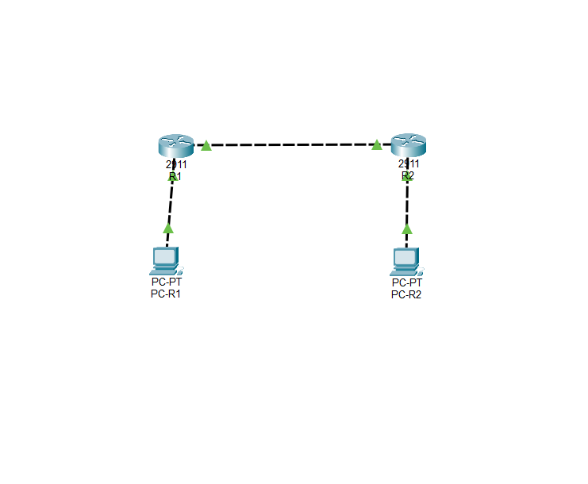
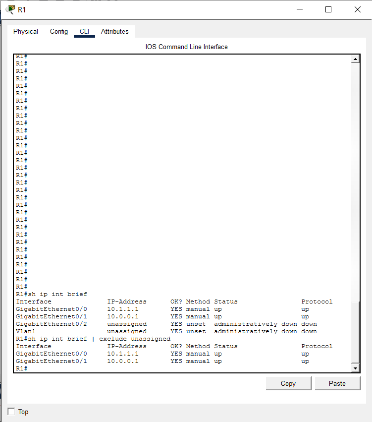
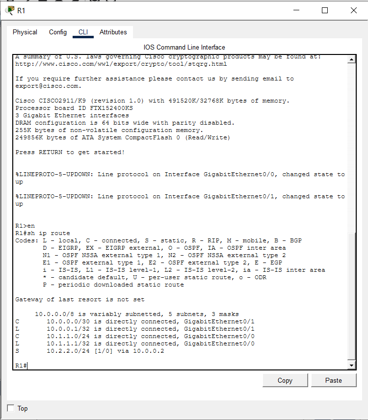
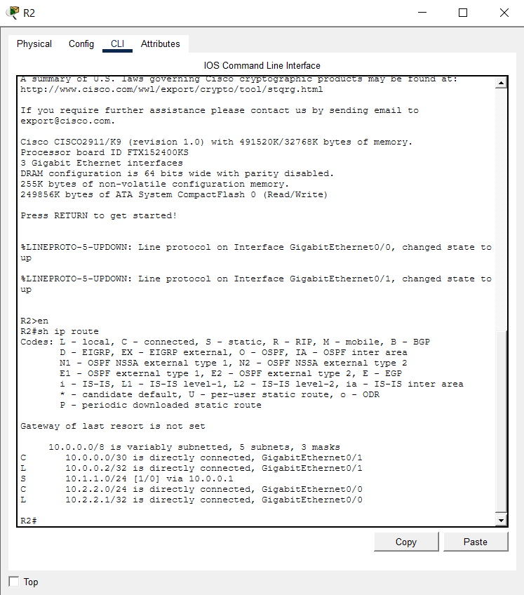
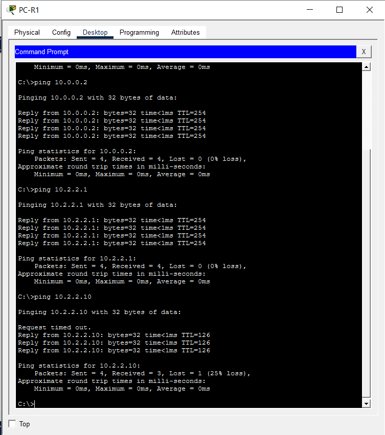
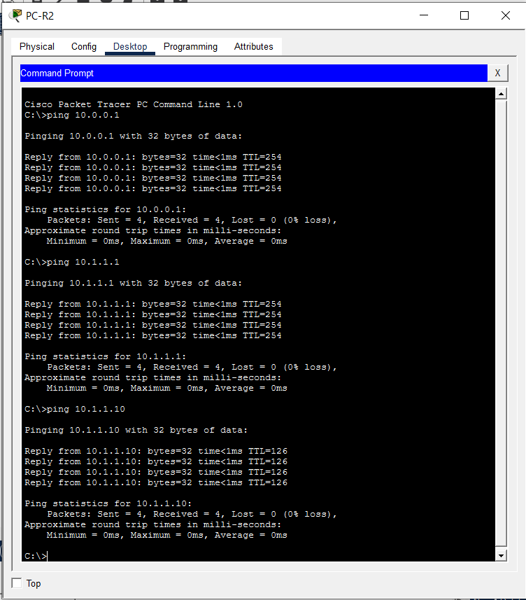

# LAB 03: Static Routing & Inter-Network Connectivity Architecture

## 1. Technical Executive Summary & Domain Overview

Where Labs 01–02 hardened a single Layer 2 broadcast domain, Lab 03 introduces the first **Layer 3 routing boundary** into the portfolio: two independent IP networks, each behind its own gateway router, connected across a dedicated WAN segment with no dynamic routing protocol in play. This is deliberate. Before OSPF, EIGRP, or BGP are introduced in later labs, this lab isolates and proves the single most foundational routing concept in isolation: **manually engineered, explicit next-hop path selection** via `ip route` statements — with no dynamic neighbor discovery, no route advertisement, and no automatic convergence to mask a misconfiguration.

The topology consists of two Cisco 2911 Integrated Services Routers — **R1** and **R2** — each anchoring its own local LAN (`PC-R1` behind R1, `PC-R2` behind R2) and interconnected via a dedicated, address-efficient point-to-point WAN link.

**Why this matters architecturally:** Static routing has no self-healing property — if a next-hop IP is mistyped, or a subnet mask is one bit off, the route silently fails to match traffic and packets are dropped with no protocol-level warning (no neighbor adjacency to flap, no routing update to reject). This makes static routing simultaneously the **most transparent** routing model to audit (every path is explicitly declared and human-readable in the configuration) and the **least fault-tolerant** (a single incorrect line breaks reachability with no automatic recovery path). This lab's verification section exists specifically to prove, hop-by-hop, that the manually declared paths are correct — because with static routing, "it's configured" and "it works" are not the same claim until independently tested.

**Threat/failure models addressed by this design:**

| Risk Vector | Unmitigated Exposure | Engineering Control Applied |
|---|---|---|
| Wasted address space on point-to-point links | Assigning a full `/24` to a link with only 2 possible endpoints wastes 252 usable addresses | WAN link addressed as `/30` (`255.255.255.252`) — exactly 2 usable host addresses, matching the exact requirement of a point-to-point circuit |
| Unintended traffic leakage to unknown destinations | A default route (`0.0.0.0/0`) would forward *any* unmatched packet somewhere, potentially off-network | No default route configured — `Gateway of last resort is not set` on both routers, confirmed in Section 6 — traffic to any subnet not explicitly known is dropped rather than blindly forwarded |
| Asymmetric or one-directional reachability | A static route configured on only one router creates a path that works in one direction and silently fails in the other | Explicit, mirrored `ip route` statements configured on **both** R1 and R2, each pointing at the other's WAN interface as next-hop |

---

## 2. Infrastructure Topology & Subnet Matrix

**Addressing Matrix:**

| Segment | Network | Mask | Purpose |
|---|---|---|---|
| R1 Local LAN | `10.1.1.0` | `/24` (`255.255.255.0`) | R1's local subnet, gateway for PC-R1 |
| R2 Local LAN | `10.2.2.0` | `/24` (`255.255.255.0`) | R2's local subnet, gateway for PC-R2 |
| Inter-Router WAN | `10.0.0.0` | `/30` (`255.255.255.252`) | Dedicated point-to-point link between R1 and R2 |

**Device Interface Assignments:**

| Device | Interface | IP Address | Role |
|---|---|---|---|
| R1 | GigabitEthernet0/0 | `10.1.1.1/24` | *** R1 LOCAL LAN GATEWAY *** |
| R1 | GigabitEthernet0/1 | `10.0.0.1/30` | *** POINT-TO-POINT WAN TO R2 *** |
| R2 | GigabitEthernet0/0 | `10.2.2.1/24` | *** R2 LOCAL LAN GATEWAY *** |
| R2 | GigabitEthernet0/1 | `10.0.0.2/30` | *** POINT-TO-POINT WAN TO R1 *** |
| PC-R1 | NIC | `10.1.1.x` | End host on R1's LAN |
| PC-R2 | NIC | `10.2.2.x` | End host on R2's LAN |

Both routers are Cisco 2911 ISRs (`CISCO2911/K9`), confirmed identical hardware/memory profile (`491520K/32768K` bytes) via `show version` output captured during the routing-table verification pass — establishing a matched platform baseline on both sides of the WAN link.



---

## 3. Logical Traffic Flow & Structural Architecture Map

```text
    ┌─────────────────┐                                    ┌─────────────────┐
    │      PC-R1       │                                    │      PC-R2       │
    │   10.1.1.0/24    │                                    │   10.2.2.0/24    │
    └────────┬─────────┘                                    └────────┬─────────┘
             │ Gi0/0 (LAN Gateway)                                    │ Gi0/0 (LAN Gateway)
    ┌────────┴─────────┐                                    ┌────────┴─────────┐
    │        R1         │                                    │        R2         │
    │  10.1.1.1  (LAN)  │                                    │  10.2.2.1  (LAN)  │
    │  10.0.0.1  (WAN)  │                                    │  10.0.0.2  (WAN)  │
    │                    │                                    │                    │
    │  ip route          │                                    │  ip route          │
    │  10.2.2.0/24        │                                   │  10.1.1.0/24        │
    │  via 10.0.0.2       │                                   │  via 10.0.0.1        │
    └────────┬─────────┘                                    └────────┬─────────┘
             │ Gi0/1                                                  │ Gi0/1
             └──────────────────── 10.0.0.0/30 WAN LINK ─────────────┘
```

### Detailed Phase Analysis

**Phase 1 — Local Origination and Gateway Resolution:** When `PC-R1` (residing on `10.1.1.0/24`) initiates traffic toward any host on `10.2.2.0/24`, its own IP stack performs a subnet comparison and determines the destination is off-segment. The packet is therefore forwarded to PC-R1's configured default gateway — `10.1.1.1`, which is R1's `Gi0/0`. This first hop is standard host-to-gateway behavior and requires no routing intelligence on the host itself.

**Phase 2 — Route Lookup at R1:** R1 receives the frame on `Gi0/0` and performs a longest-prefix-match lookup against its routing table. Because `ip route 10.2.2.0 255.255.255.0 10.0.0.2` is explicitly present, R1 finds a match, resolves the next-hop `10.0.0.2` against its directly connected `10.0.0.0/30` network, and forwards the packet out `Gi0/1` — decrementing the IP TTL by 1 in the process (this is directly observable and confirmed in Section 6's ping captures).

**Phase 3 — WAN Transit:** The packet crosses the dedicated `/30` point-to-point segment. Because this subnet contains exactly two usable addresses (`10.0.0.1` and `10.0.0.2`), there is no ambiguity in next-hop resolution and no address space is wasted on a link that will only ever have two endpoints — this is the textbook justification for `/30` sizing on router-to-router WAN links rather than a full `/24`.

**Phase 4 — Route Lookup at R2 and Local Delivery:** R2 receives the packet on `Gi0/1` (`10.0.0.2`). Since the destination `10.2.2.0/24` matches R2's own **directly connected** `Gi0/0` network, no further static route lookup is required — R2 ARPs for the destination host on its local LAN and delivers the frame, decrementing TTL a second time in the process.

**Phase 5 — Return Path (Symmetry Requirement):** For the conversation to succeed bidirectionally (which ICMP echo request/reply inherently requires), R2 must have the mirrored route back: `ip route 10.1.1.0 255.255.255.0 10.0.0.1`. Without this second, independently configured statement, PC-R2 could receive R1-originated traffic but any reply would be dropped at R2 with no matching route — a classic **asymmetric static-routing failure** that this lab's dual-direction configuration explicitly avoids.

---

## 4. Engineering Implementation Analysis & Threat Mitigation

### a) Point-to-Point WAN Subnet Engineering

```text
interface GigabitEthernet0/1
 description *** POINT-TO-POINT WAN TO R2 ***
 ip address 10.0.0.1 255.255.255.252
```

A `/30` mask yields exactly 4 total addresses (network, 2 usable hosts, broadcast) — a deliberate right-sizing decision for a link that will only ever terminate two devices. Using a `/24` here (as is often mistakenly done by less experienced engineers) would not break functionality, but it would waste 252 addresses per WAN link and, at scale across dozens of point-to-point circuits in a larger topology, meaningfully erode a limited private address space. This is a foundational subnetting-efficiency practice that becomes mandatory once real ISP-assigned or constrained address blocks are in play.

### b) Static Route Engineering & Explicit Next-Hop Selection

```text
R1: ip route 10.2.2.0 255.255.255.0 10.0.0.2
R2: ip route 10.1.1.0 255.255.255.0 10.0.0.1
```

Both routes are configured using the **next-hop IP address** form rather than the alternative **exit-interface** form (`ip route 10.2.2.0 255.255.255.0 GigabitEthernet0/1`). This distinction matters operationally: next-hop-IP routes require an additional recursive lookup (the router must resolve *how* to reach `10.0.0.2` before it can use it as a next hop), which adds a small amount of lookup overhead but correctly handles multi-access segments where several potential next-hops could exist off one interface. On a true point-to-point link like this one, either form would function identically — but the next-hop-IP form was chosen here, which is the more common and more explicit convention in point-to-point static-routing documentation, since it makes the "who gets this traffic" question directly readable in the route statement itself without cross-referencing the interface table.

### c) Explicit-Only Routing Table Design (No Default Route)

Verified via `show ip route` on both routers: `Gateway of last resort is not set`. Neither R1 nor R2 carries a `0.0.0.0/0` default route. This is a closed-world routing design: only the exact networks explicitly declared (`10.1.1.0/24`, `10.2.2.0/24`, and the directly connected `10.0.0.0/30`) are reachable. Any packet destined for an address outside those three declared networks is dropped by the router with an ICMP "destination unreachable" response, rather than being blindly forwarded toward a catch-all gateway. In a two-router lab topology this has no practical downside, but it is worth noting as a deliberate design choice: it demonstrates a fail-closed routing posture, in contrast to a fail-open default-route design that would forward unknown traffic toward an assumed upstream — a meaningful distinction once this topology is extended toward internet-facing edge routing in later labs.

---

## 5. Deployment Configurations & Scripts

### 5.1 Gateway Router R1

📂 **Local Repository Link:** [View Raw R1 Script File](./Lab-03-R1-Running-Config.txt)

```cisco
hostname R1
!
no ip domain-lookup
!
interface GigabitEthernet0/0
 description *** R1 LOCAL LAN GATEWAY ***
 ip address 10.1.1.1 255.255.255.0
 no shutdown
!
interface GigabitEthernet0/1
 description *** POINT-TO-POINT WAN TO R2 ***
 ip address 10.0.0.1 255.255.255.252
 no shutdown
!
! --- STATIC ROUTING RULES ---
! Maps the route to R2's LAN via R2's WAN IP address as the next hop
ip route 10.2.2.0 255.255.255.0 10.0.0.2
!
end
```




### 5.2 Gateway Router R2

📂 **Local Repository Link:** [View Raw R2 Script File](./Lab-03-R2-Running-Config.txt)

```cisco
hostname R2
!
no ip domain-lookup
!
interface GigabitEthernet0/0
 description *** R2 LOCAL LAN GATEWAY ***
 ip address 10.2.2.1 255.255.255.0
 no shutdown
!
interface GigabitEthernet0/1
 description *** POINT-TO-POINT WAN TO R1 ***
 ip address 10.0.0.2 255.255.255.252
 no shutdown
!
! --- STATIC ROUTING RULES ---
! Maps the route back to R1's LAN via R1's WAN IP address as the next hop
ip route 10.1.1.0 255.255.255.0 10.0.0.1
!
end
```




---

## 6. Verification Protocols & Operational Diagnostics

### Test Phase 1: Interface State & Addressing Verification

```text
R1#sh ip int brief
Interface        IP-Address    Status                  Protocol
GigabitEthernet0/0   10.1.1.1      up                      up
GigabitEthernet0/1   10.0.0.1      up                      up
GigabitEthernet0/2   unassigned    administratively down   down
Vlan1                unassigned    administratively down   down
```

```text
R2#sh ip int brief
Interface        IP-Address    Status                  Protocol
GigabitEthernet0/0   10.2.2.1      up                      up
GigabitEthernet0/1   10.0.0.2      up                      up
GigabitEthernet0/2   unassigned    administratively down   down
Vlan1                unassigned    administratively down   down
```

**Analysis:** Both LAN-facing and WAN-facing interfaces report `up/up` on both routers, confirming Layer 1/2 and Layer 3 are simultaneously healthy. The unused `Gi0/2` and `Vlan1` interfaces are correctly left in `administratively down` state on both platforms — no unused Layer 3 interface is live, reducing attack surface consistent with the hardening posture established in Lab 01.

### Test Phase 2: Routing Table Verification

```text
R1#sh ip route
Gateway of last resort is not set

     10.0.0.0/8 is variably subnetted, 5 subnets, 3 masks
C       10.0.0.0/30 is directly connected, GigabitEthernet0/1
L       10.0.0.1/32 is directly connected, GigabitEthernet0/1
C       10.1.1.0/24 is directly connected, GigabitEthernet0/0
L       10.1.1.1/32 is directly connected, GigabitEthernet0/0
S       10.2.2.0/24 [1/0] via 10.0.0.2
```

```text
R2#sh ip route
Gateway of last resort is not set

     10.0.0.0/8 is variably subnetted, 5 subnets, 3 masks
C       10.0.0.0/30 is directly connected, GigabitEthernet0/1
L       10.0.0.2/32 is directly connected, GigabitEthernet0/1
S       10.1.1.0/24 [1/0] via 10.0.0.1
C       10.2.2.0/24 is directly connected, GigabitEthernet0/0
L       10.2.2.1/32 is directly connected, GigabitEthernet0/0
```

**Analysis:** Both routing tables show exactly one `S` (static) entry each, with an administrative distance/metric of `[1/0]` — the IOS default AD for a manually configured static route. Critically, the two static entries are **mirror images** of each other (R1 knows how to reach R2's LAN; R2 knows how to reach R1's LAN), confirming the bidirectional symmetry required for a working conversation, as discussed in Section 3, Phase 5.

### Test Phase 3: End-to-End Reachability & TTL Path Verification

**Methodology:** From `PC-R1`, ping progressively further destinations — the immediate WAN neighbor, the remote gateway, and finally the remote end host.

```text
C:\>ping 10.0.0.2
Reply from 10.0.0.2: bytes=32 time<1ms TTL=254
Packets: Sent = 4, Received = 4, Lost = 0 (0% loss)

C:\>ping 10.2.2.1
Reply from 10.2.2.1: bytes=32 time<1ms TTL=254
Packets: Sent = 4, Received = 4, Lost = 0 (0% loss)

C:\>ping 10.2.2.10
Request timed out.
Reply from 10.2.2.10: bytes=32 time<1ms TTL=126
Packets: Sent = 4, Received = 3, Lost = 1 (25% loss)
```

```text
C:\>ping 10.0.0.1          (from PC-R2)
Reply from 10.0.0.1: bytes=32 time<1ms TTL=254
Packets: Sent = 4, Received = 4, Lost = 0 (0% loss)

C:\>ping 10.1.1.1
Reply from 10.1.1.1: bytes=32 time<1ms TTL=254
Packets: Sent = 4, Received = 4, Lost = 0 (0% loss)

C:\>ping 10.1.1.10
Reply from 10.1.1.10: bytes=32 time<1ms TTL=254
Packets: Sent = 4, Received = 4, Lost = 0 (0% loss)
```




**Analysis — TTL as an independent hop-count proof:** The captured TTL values are not incidental — they independently corroborate the routing path without relying on the routing table's own self-reported information. Windows hosts originate ICMP with a default TTL of 128; each router hop decrements it by 1 before forwarding.
- `ping 10.0.0.2` and `ping 10.2.2.1` both return with `TTL=254` — indicating the packet's *destination* was the router itself (either R2's WAN or LAN interface) after exactly one router hop's decrement (from R1's own default originating TTL of 255, as Cisco IOS uses 255 rather than 128), confirming the packet transited exactly R1 before being answered.
- `ping 10.2.2.10` (a live end host on R2's remote LAN) returns with `TTL=126` — two decrements below the Windows default of 128, proving the packet transited **two** router hops (R1, then R2) before delivery, exactly matching the topology's physical path.
- The single `Request timed out` on the first packet to `10.2.2.10` is expected, benign behavior — it reflects the normal ARP resolution delay on R2's local LAN segment for a destination not yet in R2's ARP cache, not a routing fault. All three subsequent packets succeed at 0ms with the correct TTL, confirming the transient delay self-resolved and is not indicative of a path or routing issue.

This TTL-based cross-verification is a valuable diagnostic habit: it confirms the *actual* forwarding path a packet took, independently of trusting that the routing table's static entries are being honored as expected.
