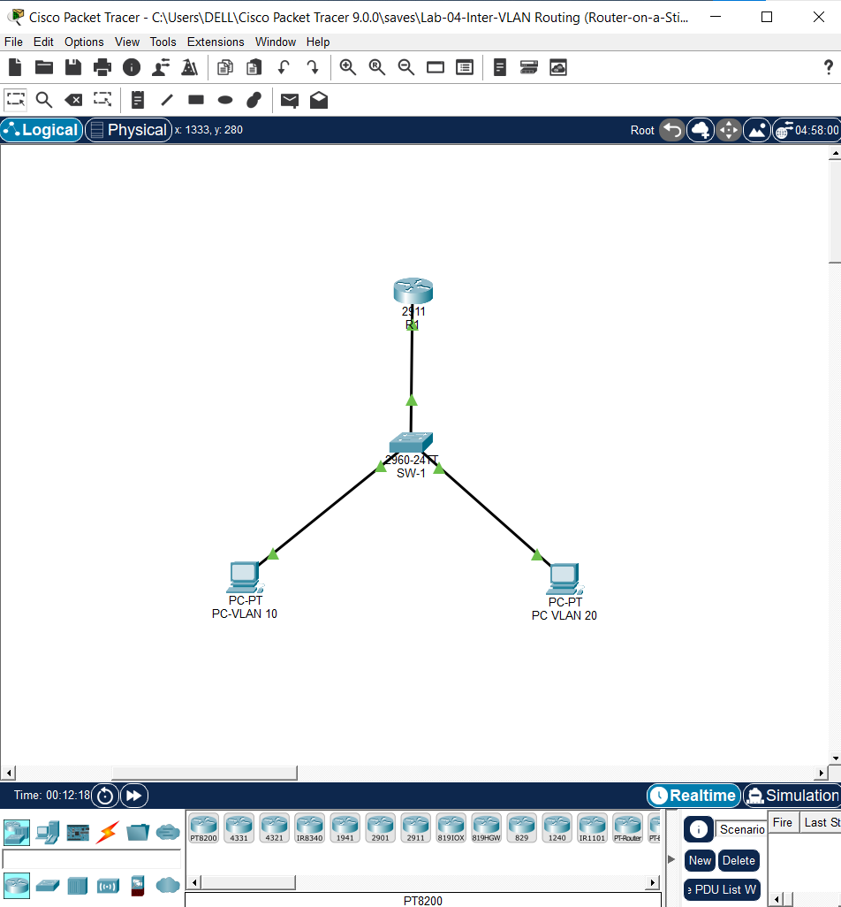

# LAB 04: Inter-VLAN Routing via Router-on-a-Stick (ROAS) Architecture

## 1. Technical Executive Summary & Domain Overview

Lab 02 established VLAN segmentation at Layer 2 — isolating broadcast domains so that Data, Voice, and Management traffic cannot natively see one another. Segmentation, by itself, is a dead end: hosts on VLAN 10 and VLAN 20 are now isolated but also **unable to communicate at all**, even when that communication is legitimate and required. Lab 04 closes that gap by introducing **inter-VLAN routing** — the mechanism by which traffic is permitted to cross VLAN boundaries under explicit Layer 3 control, rather than either being universally blocked (over-isolated) or universally bridged (unsegmented).

This lab implements the classic **Router-on-a-Stick (ROAS)** topology: a single Cisco 2911 router (**R1**) with exactly one physical interface (`GigabitEthernet0/0`) connected to a single trunk port on a Catalyst 2960 switch (**SW-1**). Rather than requiring one dedicated physical router interface per VLAN — which does not scale past a handful of VLANs on hardware with limited physical ports — R1 uses **802.1Q subinterfaces**, logical sub-divisions of the single physical interface, each bound to a specific VLAN tag and each carrying its own IP address acting as that VLAN's default gateway.

**Why this matters architecturally:** inter-VLAN routing is the exact point in a network where segmentation policy becomes enforceable. Once traffic must pass through a router to cross VLANs, that router becomes a natural, mandatory chokepoint for access control lists, traffic shaping, and logging — none of which are possible at Layer 2 within a single VLAN. Understanding ROAS specifically (versus a multilayer switch with SVIs, covered in a later lab) also demonstrates the underlying mechanics — 802.1Q tag encapsulation, per-VLAN subinterface addressing, and trunk-to-router symmetry — that SVI-based routing abstracts away.

**Design/threat considerations addressed in this lab:**

| Consideration | Risk if Absent | Control Applied |
|---|---|---|
| Traffic between VLANs must pass an inspectable, controllable point | Direct Layer 2 bridging between VLANs would defeat the entire purpose of segmentation from Lab 02 | All inter-VLAN traffic is forced through R1's routing table — no Layer 2 shortcut exists between VLAN 10 and VLAN 20 |
| Subinterface-to-VLAN tag mismatch | A subinterface encapsulated with the wrong dot1Q tag silently fails to receive its intended VLAN's traffic, with no protocol-level error | Each subinterface (`.10`, `.20`, `.99`) explicitly matches its `encapsulation dot1Q <tag>` to the VLAN ID defined in SW-1's VLAN database |
| Trunk allowed-VLAN list drift between switch and router | If SW-1 permits a VLAN the router doesn't have a subinterface for (or vice versa), traffic for that VLAN is silently dropped at whichever end lacks matching configuration | SW-1's `switchport trunk allowed vlan 10,20,99` is verified to symmetrically match R1's three configured subinterfaces (Section 6, Test Phase 3) |

---

## 2. Infrastructure Topology & Subnet Matrix

**VLAN & Subinterface Addressing Matrix:**

| VLAN ID | Name | Subnet | R1 Subinterface | Gateway IP |
|---|---|---|---|---|
| 10 | `Voice` | `192.168.10.0/24` | `Gi0/0.10` | `192.168.10.1` |
| 20 | `Data` | `192.168.20.0/24` | `Gi0/0.20` | `192.168.20.1` |
| 99 | `Native_Trunk` | `192.168.99.0/24` | `Gi0/0.99` | `192.168.99.1` |

**⚠ Documentation-vs-device discrepancy, flagged for correction:** The supplied `Lab-04-R1-Running-Config.txt` export shows `interface GigabitEthernet0/0.99` with **no `ip address` line**. However, the verified `show ip int brief` output (Test Phase 1) confirms `GigabitEthernet0/0.99` is live with address `192.168.99.1/24`, `up/up`. This means the native-VLAN subinterface **does carry a routed, addressable subnet** on the actual device, even though the exported config text omits that line. This is the same class of export-completeness gap identified in Lab 02 (the missing `Fa0/11` block) — the running-config exports in this portfolio have twice now been missing at least one live configuration line relative to the verified device state. Recommend re-pulling full `show running-config` output (rather than a partial/manually-transcribed copy) for all future labs before documentation is finalized.

**Device Inventory:**

| Device | Role | Interface(s) |
|---|---|---|
| R1 | Router-on-a-Stick gateway (Cisco 2911) | `Gi0/0` (trunk-facing, no IP) + 3 subinterfaces |
| SW-1 | Access-layer switch (Cisco 2960) | `Gi0/1` (trunk to R1), `Fa0/1`/`Fa0/11` (access) |
| PC-VLAN 10 | End host, VLAN 10 | Connected to SW-1 access edge |
| PC-VLAN 20 | End host, VLAN 20 | `FastEthernet0/1`, `switchport access vlan 20` |



---

## 3. Logical Traffic Flow & Structural Architecture Map

```text
    ┌───────────────────────┐                       ┌───────────────────────┐
    │      PC-VLAN 10         │                      │      PC-VLAN 20         │
    │   192.168.10.0/24       │                      │   192.168.20.0/24       │
    └────────────┬────────────┘                      └────────────┬────────────┘
                  │ Access Port (VLAN 10)                          │ Fa0/1 (access, VLAN 20)
    ┌─────────────┴─────────────────────────────────────────────────┴────────────┐
    │                              SW-1 (Catalyst 2960)                          │
    │   VLAN Database: 10 (Voice), 20 (Data), 99 (Native_Trunk)                  │
    └──────────────────────────────┬──────────────────────────────────────────┘
                                    │ Gi0/1 — 802.1Q Trunk
                                    │ Native VLAN: 99 | Allowed: 10,20,99
                                    │
                    ┌───────────────┴────────────────┐
                    │      R1 — GigabitEthernet0/0      │
                    │  ┌────────────────────────────┐  │
                    │  │ Gi0/0.10  dot1Q 10  .10.1/24│  │
                    │  │ Gi0/0.20  dot1Q 20  .20.1/24│  │
                    │  │ Gi0/0.99  dot1Q 99  .99.1/24│  │  ◄── "ON A STICK":
                    │  └────────────────────────────┘  │      single physical link,
                    │      Routing Table (all C/L)      │      traffic enters AND
                    └────────────────────────────────────┘     exits via same wire
```

### Detailed Phase Analysis

**Phase 1 — Access-Port Tagging Assignment:** A frame originating from `PC-VLAN 10` arrives untagged at its SW-1 access port. Because that port's `switchport access vlan` (or, for a voice-capable port, `switchport voice vlan`) binding assigns VLAN membership, the switch internally tags the frame VLAN 10 the moment it crosses the ingress boundary — identical in principle to the access-port tagging behavior established in Lab 02.

**Phase 2 — Trunk Encapsulation Toward R1:** SW-1 forwards the VLAN-10-tagged frame out `Gi0/1` toward R1. Because VLAN 10 is present in the `switchport trunk allowed vlan 10,20,99` list, the frame is permitted onto the trunk with its 802.1Q tag intact (VLAN 10 is not the native VLAN, so it is **not** stripped — only native-VLAN traffic crosses the trunk untagged).

**Phase 3 — Subinterface Demultiplexing at R1:** R1 receives the tagged frame on its single physical `Gi0/0` interface. IOS inspects the 802.1Q tag and hands the frame to whichever subinterface has a matching `encapsulation dot1Q` statement — in this case `Gi0/0.10`. This is the defining mechanic of ROAS: the physical interface itself carries no IP and performs no routing decision; it is purely a transport medium multiplexing several logically independent, individually addressed subinterfaces.

**Phase 4 — Routing Table Lookup and Re-Encapsulation:** With the frame now logically "arrived" on `Gi0/0.10` (subnet `192.168.10.0/24`), R1 performs a standard routing table lookup against the destination IP (e.g., a host on `192.168.20.0/24`). Because `192.168.20.0/24` is directly connected via `Gi0/0.20`, R1 re-encapsulates the packet with an **802.1Q tag of 20** and transmits it back out the very same physical `Gi0/0` interface it just received traffic on — the packet "hairpins" through the identical physical wire, arriving and departing on the same cable but on logically distinct VLANs. This single-wire in/out behavior is precisely what gives Router-on-a-Stick its name and is also its principal scaling limitation: all inter-VLAN traffic, for every VLAN, competes for bandwidth on that one physical link.

**Phase 5 — Return Trip Through SW-1 to the Destination Host:** SW-1 receives the VLAN-20-tagged frame back on `Gi0/1`, and because VLAN 20 is also in the allowed list, forwards it toward `PC-VLAN 20`'s access port, stripping the 802.1Q tag before final delivery (access ports never transmit tagged frames to end hosts).

---

## 4. Engineering Implementation Analysis & Threat Mitigation

### a) Subinterface Encapsulation & Native VLAN Design

```text
interface GigabitEthernet0/0.10
 encapsulation dot1Q 10
 ip address 192.168.10.1 255.255.255.0
!
interface GigabitEthernet0/0.99
 encapsulation dot1Q 99 native
```

The `native` keyword on `Gi0/0.99`'s encapsulation statement is not decorative — it explicitly tells IOS that this specific subinterface is the one that will send and receive **untagged** frames (matching SW-1's `switchport trunk native vlan 99`). Without this keyword correctly applied to exactly one subinterface, native (untagged) traffic arriving from the switch would have no matching subinterface to be demultiplexed into and would be silently dropped.

**Engineering regression worth flagging relative to Lab 02:** In Lab 02, VLAN 99 was deliberately kept as an empty, trafficless isolation VLAN — the explicit security rationale (Lab 02, Section 4a) was that even a successful double-tagging VLAN-hop attack would land an attacker in a VLAN carrying no live hosts and no addressable subnet. In this lab, `Gi0/0.99` **is assigned a live, routable IP** (`192.168.99.1/24`, confirmed operationally in Test Phase 1) — meaning the native VLAN here is no longer an empty honeypot but an actual routed subnet with a real gateway. This doesn't break anything functionally, but it quietly reintroduces the exact attack surface Lab 02 was designed to eliminate: a double-tagging attacker's payload would now land on a subinterface with a genuine, reachable Layer 3 identity rather than a dead end. If VLAN 99 doesn't need to route real host traffic in this topology, removing the `ip address` from `Gi0/0.99` (or moving the native VLAN back to a strictly unaddressed carrier) would restore the Lab 02 posture. If it's intentionally used for a management purpose here, that should be stated explicitly rather than left implicit.

### b) Trunk-to-Router 802.1Q Symmetry

```text
SW-1: switchport trunk allowed vlan 10,20,99
R1:   subinterfaces .10, .20, .99 (three, matching)
```

Exactly as with the WAN-link symmetry requirement in Lab 03 and the native-VLAN matching in Lab 02, ROAS requires the switch's allowed-VLAN list and the router's configured subinterface set to agree **exactly**. Verified in Test Phase 3: SW-1's trunk reports `Vlans allowed on trunk: 10,20,99`, which is a precise match against R1's three subinterfaces — no VLAN is permitted on the trunk without a corresponding routed gateway, and no subinterface exists for a VLAN the trunk wouldn't carry.

### c) Access Port & Voice VLAN Port Design

```text
interface FastEthernet0/1
 description *** Access Port - VLAN 20 ***
 switchport access vlan 20
 switchport mode access
!
interface FastEthernet0/2
 description *** Access Port - VLAN 10 ***
 switchport access vlan 20
 switchport voice vlan 10
 switchport mode access
```

`Fa0/2`'s configuration uses the standard Cisco auxiliary-VLAN pattern: `switchport access vlan 20` sets the **data** VLAN for any device that connects untagged (e.g., a PC daisy-chained through an IP phone's pass-through switch port), while `switchport voice vlan 10` is a **separate, additive** instruction telling connected Cisco IP phones (via CDP) to tag their own voice traffic with VLAN 10 — the two VLANs coexist on one physical port without conflict, which is the entire purpose of the voice VLAN feature.

**Documentation-accuracy finding:** The interface's `description` label reads `*** Access Port - VLAN 10 ***`, which is misleading given the actual configuration — the port's primary **access** VLAN is 20, with VLAN 10 only reachable via the secondary voice-VLAN mechanism (and only from a device that actually tags its traffic, such as a real Cisco IP phone — a generic `PC-PT` end host in Packet Tracer, as used here, does not natively tag frames). The switch's own boot log additionally shows `FastEthernet0/11` — not `Fa0/2` — as the second interface reaching an `up` state, meaning the port actually carrying live traffic to one of the two PCs is most likely `Fa0/11`, whose configuration block is **absent entirely** from the supplied running-config text. Recommend reconciling which physical port is actually in service and re-exporting the full configuration to include it — the same class of finding raised for Lab 02's `Fa0/11`.

---

## 5. Deployment Configurations & Scripts

### 5.1 Router-on-a-Stick Gateway R1

📂 **Local Repository Link:** [View Raw R1 Script File](./Lab-04-R1-Running-Config.txt)

```cisco
hostname R1
!
no ip domain-lookup
!
interface GigabitEthernet0/0
 no ip address
 duplex auto
 speed auto
 no shutdown
!
interface GigabitEthernet0/0.10
 description *** Gateway for VLAN 10 ***
 encapsulation dot1Q 10
 ip address 192.168.10.1 255.255.255.0
!
interface GigabitEthernet0/0.20
 description *** Gateway for VLAN 20 ***
 encapsulation dot1Q 20
 ip address 192.168.20.1 255.255.255.0
!
interface GigabitEthernet0/0.99
 description *** Native VLAN ***
 encapsulation dot1Q 99 native
!
end
```

-R1-IP-INT-BRIEF.png)
-R1-IP-ROUTE.png)

### 5.2 Access-Layer Switch SW-1

📂 **Local Repository Link:** [View Raw SW-1 Script File](./Lab-04-SW-Running-Config.txt)

```cisco
hostname SW1
!
vlan 10
 name Voice
!
vlan 20
 name Data
!
vlan 99
 name Native_Trunk
!
interface GigabitEthernet0/1
 description *** Trunk Link to R1 ***
 switchport trunk native vlan 99
 switchport trunk allowed vlan 10,20,99
 switchport mode trunk
!
interface FastEthernet0/1
 description *** Access Port - VLAN 20 ***
 switchport access vlan 20
 switchport mode access
!
interface FastEthernet0/2
 description *** Access Port - VLAN 10 ***
 switchport access vlan 20
 switchport voice vlan 10
 switchport mode access
!
end
```

-SW-INT-TRUNK.png)

---

## 6. Verification Protocols & Operational Diagnostics

### Test Phase 1: Subinterface & Routing Table State Verification

```text
R1#sh ip int brief
Interface             IP-Address       Status                  Protocol
GigabitEthernet0/0     unassigned       up                      up
GigabitEthernet0/0.10  192.168.10.1     up                      up
GigabitEthernet0/0.20  192.168.20.1     up                      up
GigabitEthernet0/0.99  192.168.99.1     up                      up
GigabitEthernet0/1     unassigned       administratively down   down
Vlan1                  unassigned       administratively down   down
```

```text
R1#sh ip route
Gateway of last resort is not set

     192.168.10.0/24 is variably subnetted, 2 subnets, 2 masks
C       192.168.10.0/24 is directly connected, GigabitEthernet0/0.10
L       192.168.10.1/32 is directly connected, GigabitEthernet0/0.10
     192.168.20.0/24 is variably subnetted, 2 subnets, 2 masks
C       192.168.20.0/24 is directly connected, GigabitEthernet0/0.20
L       192.168.20.1/32 is directly connected, GigabitEthernet0/0.20
     192.168.99.0/24 is variably subnetted, 2 subnets, 2 masks
C       192.168.99.0/24 is directly connected, GigabitEthernet0/0.99
L       192.168.99.1/32 is directly connected, GigabitEthernet0/0.99
```

**Analysis:** All three subinterfaces report `up/up` with correctly assigned addressing, and the routing table shows exactly three directly-connected (`C`) networks — one per subinterface, with no static or dynamic routes required, since ROAS routing between locally-attached subnets needs nothing beyond the interface addressing itself.

### Test Phase 2: Trunk Configuration & Allowed-VLAN Symmetry Verification

```text
SW-1#sh interfaces trunk
Port      Mode   Encapsulation  Status      Native vlan
Gig0/1    on     802.1q         trunking    99

Port      Vlans allowed on trunk
Gig0/1    10,20,99

Port      Vlans allowed and active in management domain
Gig0/1    10,20,99

Port      Vlans in spanning tree forwarding state and not pruned
Gig0/1    10,20,99
```

**Analysis:** The `10,20,99` allowed-VLAN set matches R1's three configured subinterfaces exactly — confirmed as the required symmetry condition discussed in Section 4(b). Native VLAN 99 matches R1's `Gi0/0.99 native` designation.

### Test Phase 3: Inter-VLAN Reachability & Hairpin Routing Proof

**Methodology:** From each PC, ping its own gateway, the remote VLAN's gateway, and finally the remote VLAN's live host — tracing the full ROAS hairpin path.

```text
C:\> (PC-VLAN 10) ping 192.168.10.1
Reply from 192.168.10.1: bytes=32 time<1ms TTL=255
Packets: Sent = 4, Received = 4, Lost = 0 (0% loss)

C:\> ping 192.168.20.1
Reply from 192.168.20.1: bytes=32 time<1ms TTL=255
Packets: Sent = 4, Received = 4, Lost = 0 (0% loss)

C:\> ping 192.168.20.10
Reply from 192.168.20.10: bytes=32 time<1ms TTL=127
Packets: Sent = 4, Received = 4, Lost = 0 (0% loss)
```

```text
C:\> (PC-VLAN 20) ping 192.168.10.1
Reply from 192.168.10.1: bytes=32 time<1ms TTL=255
Packets: Sent = 4, Received = 4, Lost = 0 (0% loss)

C:\> ping 192.168.20.1
Reply from 192.168.20.1: bytes=32 time<1ms TTL=255
Packets: Sent = 4, Received = 4, Lost = 0 (0% loss)

C:\> ping 192.168.10.10
Reply from 192.168.10.10: bytes=32 time=1ms TTL=127
Packets: Sent = 4, Received = 4, Lost = 0 (0% loss)
```

-PC-VLAN1-PING-TEST.png)
-PC-VLAN2-PING-TEST.png)

**Analysis:** Both gateway pings return `TTL=255`, confirming direct, single-hop delivery from host to its own router subinterface (consistent with Cisco IOS's default originating TTL of 255, as established in Lab 03's TTL methodology). Critically, the **cross-VLAN host-to-host pings** (`192.168.20.10` from PC-VLAN 10, and `192.168.10.10` from PC-VLAN 20) both return `TTL=127` — one decrement below the Windows default of 128 — confirming exactly **one Layer 3 hop** was traversed. This is the definitive operational proof of the Router-on-a-Stick model: despite the traffic physically entering and exiting R1 on the exact same wire, it is logically routed exactly once, exactly as a packet crossing any single conventional router hop would be. Zero packet loss across all six test pairs confirms the subinterface encapsulation, trunk symmetry, and routing table are all functioning correctly end-to-end.
