# LAB 05: Spanning Tree Protocol (Rapid PVST+) & Redundant Topology Loop Prevention Architecture

## 1. Technical Executive Summary & Domain Overview

Every lab in this portfolio up to this point has used a topology with exactly one path between any two devices. Lab 05 deliberately breaks that assumption: it introduces **physical redundancy** — a four-switch ring (`CORE-SW` at the top, `DIST-A` and `DIST-B` as dual distribution-layer switches on either side, and `SW-ACCESS` at the bottom) where every switch has two physical paths to every other switch. Redundancy at Layer 2 is a double-edged design choice: it is the only way to survive a single link or switch failure without an outage, but a Layer 2 broadcast domain with more than one active path between any two points is also a **guaranteed broadcast storm** — Ethernet frames have no TTL field, so a looped frame will circulate the ring indefinitely, being flooded and re-flooded at every switch, exponentially consuming bandwidth and CPU until the network becomes fully saturated and unusable, typically within seconds.

**Spanning Tree Protocol (802.1D, and specifically Rapid PVST+ / 802.1w here)** is the control-plane mechanism that resolves this contradiction: it allows the physical redundancy to exist (so a failure has a path to fail over to) while mathematically guaranteeing that, at any given moment, only a **loop-free logical subset** of those physical links is actively forwarding traffic. This lab's core engineering exercise is not just "turn STP on" — every switch in this topology ships with STP enabled by default — but to **deliberately and predictably engineer which switch becomes the root bridge**, rather than leaving that decision to STP's default tiebreaker (lowest MAC address), which in a real network could unpredictably elect an underpowered access-layer switch as the root for the entire campus.

**Threat/failure models explicitly addressed:**

| Risk Vector | Unmitigated Exposure | Mitigation Applied |
|---|---|---|
| Broadcast storm from an unmanaged physical loop | A ring with STP disabled or misconfigured floods every broadcast/multicast/unknown-unicast frame infinitely around the loop | Rapid PVST+ enabled globally on all four switches, computing one loop-free logical tree per VLAN |
| Unpredictable, MAC-address-determined root bridge election | Default STP elects the switch with the numerically lowest MAC address as root — often arbitrary, and potentially an underpowered access switch never designed to carry core-layer traffic load | Explicit `spanning-tree vlan ... priority` values engineered per switch, creating a deterministic priority ladder (see Section 4a) that guarantees `CORE-SW` wins root election on every VLAN, every time, regardless of MAC address |
| Slow convergence during a link failure (legacy 802.1D can take 30–50 seconds to re-converge) | An access-layer outage during convergence is a real, user-visible service interruption | `spanning-tree mode rapid-pvst` (802.1w) enabled on all four switches — sub-second to few-second re-convergence via explicit handshake rather than passive timer expiry |

---

## 2. Infrastructure Topology & VLAN/Priority Matrix

This lab operates purely at Layer 2 — no IP addressing or SVIs are present in any of the four switch configurations. The subnet/addressing matrix from prior labs is therefore replaced here with the two matrices that actually govern this lab's behavior: the shared VLAN database, and the engineered per-switch STP priority ladder.

**VLAN Database (identical across all four switches):**

| VLAN ID | Name |
|---|---|
| 10 | Voice |
| 20 | Data |
| 30 | Management |
| 40 | Guest |
| 99 | Native_Trunk |

**Engineered Root-Bridge Priority Ladder** (`spanning-tree vlan 1,10,20,30,40,99 priority <value>`):

| Device | Role in Topology | Configured Base Priority | Design Intent |
|---|---|---|---|
| `CORE-SW` | Core / physical top of the ring | `4096` | **Primary root bridge** for every VLAN — lowest possible priority in this ladder |
| `DIST-B` | Distribution, east side | `12288` | Secondary preference — would become root only if CORE-SW fails |
| `DIST-A` | Distribution, west side | `16384` | Tertiary preference |
| `SW-ACCESS` | Access layer, physical bottom of the ring | `28672` | **Deliberately least preferred** — an access switch should never anchor the spanning tree for the whole fabric |

This descending ladder (`4096 < 12288 < 16384 < 28672`) is the entire mechanism: because a **lower** priority value wins root election in STP, this ordering makes the outcome fully deterministic and independent of any switch's burned-in MAC address.

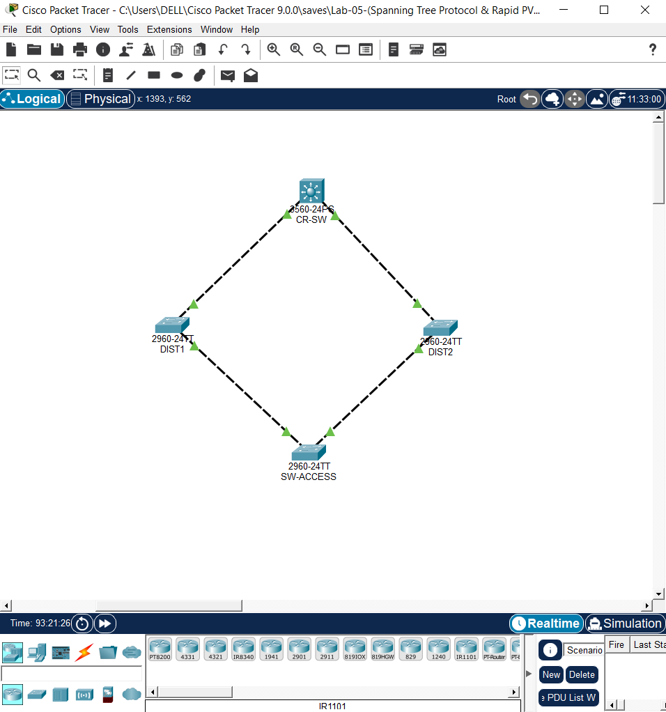

---

## 3. Logical Traffic Flow & Structural Architecture Map

```text
                         ┌─────────────────────┐
                         │       CORE-SW          │
                         │  Priority base: 4096    │
                         │  (ROOT for all VLANs)   │
                         └──────────┬──┬───────────┘
                            Gi0/1  │  │  Gi0/2
                                    │  │
              ┌─────────────────────┘  └─────────────────────┐
              │                                               │
   ┌──────────┴──────────┐                       ┌──────────┴──────────┐
   │        DIST-A          │                       │        DIST-B         │
   │  Priority base: 16384  │                       │  Priority base: 12288 │
   └──────────┬──────────┘                       └──────────┬──────────┘
              │ Gi0/2                                        │ Gi0/1 (Root Port)
              │                                               │
              └─────────────────┐             ┌────────────────┘
                                 │             │
                         ┌───────┴─────┴───────┐
                         │      SW-ACCESS         │
                         │  Priority base: 28672   │
                         │  Gi0/1 → Root Port       │
                         │  Gi0/2 → Alternate/BLK   │  ◄── loop broken here
                         └─────────────────────┘
```

### Detailed Phase Analysis

**Phase 1 — BPDU Flooding and Root Bridge Election:** On startup, all four switches begin transmitting Bridge Protocol Data Units (BPDUs) out every trunk port, each initially claiming itself as root (standard STP bootstrap behavior). Every switch compares every BPDU it receives against its own — the tiebreak order is **lowest priority first, then lowest MAC address**. Because `CORE-SW`'s engineered priority (`4096` + VLAN ID) is numerically lower than all three other switches' priorities for every VLAN in the shared set, `CORE-SW` wins root election on all of VLANs 1, 10, 20, 30, 40, and 99 — confirmed directly in Section 6 by `CORE-SW` reporting **"This bridge is the root"** on every VLAN instance queried.

**Phase 2 — Root Port Selection at Each Non-Root Switch:** Once the root is established, every other switch independently selects exactly one **Root Port** — the local port with the lowest cumulative path cost back to the root. `DIST-A` and `DIST-B` each have a single direct link to `CORE-SW`, so their root ports are immediate and unambiguous (cost 4 — one Gigabit-speed hop, per RSTP's standard short path-cost table). `SW-ACCESS`, sitting at the opposite corner of the ring with **no direct link to CORE-SW**, must choose between its two indirect paths (via `DIST-A` or via `DIST-B`) — confirmed in Section 6 to select `Gi0/1` as its root port toward the lower-cost neighbor.

**Phase 3 — Designated Port Election and Loop-Breaking:** With root ports settled, each network segment elects exactly one **Designated Port** (the port on that segment closest to the root, which continues forwarding) — every port on the root bridge itself is automatically designated. The one port in the entire ring that is neither a root port nor a designated port becomes the **Alternate Port** and is placed into a **blocking** state — forwarding no traffic, but continuing to listen for BPDUs so it can immediately take over if the active path fails. In this topology, that blocking role lands on `SW-ACCESS`'s `Gi0/2` interface (confirmed operationally in Section 6), which structurally makes sense: `SW-ACCESS` sits diametrically opposite the root in the ring, at the point where the loop's two paths (via `DIST-A` and via `DIST-B`) converge — exactly where a single cut is needed to break the physical loop into a loop-free logical tree.

**Phase 4 — Steady-State Forwarding:** With one port blocked, the four-switch physical ring now operates as a loop-free logical tree with `CORE-SW` at its root. Frames flow along the active (forwarding) paths exactly as they would in a non-redundant topology; the blocked link exists purely as cold-standby capacity, activated automatically and rapidly (via 802.1w's proposal/agreement handshake, rather than 802.1D's slower timer-based convergence) only if an active link or switch fails.

---

## 4. Engineering Implementation Analysis & Threat Mitigation

### a) Deterministic Root Bridge Priority Engineering

```text
CORE-SW:   spanning-tree vlan 1,10,20,30,40,99 priority 4096
DIST-B:    spanning-tree vlan 1,10,20,30,40,99 priority 12288
DIST-A:    spanning-tree vlan 1,10,20,30,40,99 priority 16384
SW-ACCESS: spanning-tree vlan 1,10,20,30,40,99 priority 28672
```

All four values are multiples of `4096` — this is not arbitrary: Cisco's `extended system ID` implementation folds the 12-bit VLAN ID directly into the low-order bits of the priority field, meaning any configured priority **must** be a multiple of `4096` (the smallest increment that leaves the low 12 bits free for the VLAN ID). This is why every "Bridge ID Priority" value observed in Section 6 is the configured base value plus the exact VLAN ID (e.g., `CORE-SW`'s VLAN 10 instance reports priority `4106` = `4096 + 10`) — confirmed consistently across every captured VLAN instance on every switch, validating that the priority arithmetic is behaving exactly as designed.

Applying the priority statement to the **same explicit VLAN list** (`1,10,20,30,40,99`) on all four switches — rather than leaving any VLAN at the STP default of `32768` — closes a real gap: any VLAN left un-tuned falls back to pure MAC-address tiebreaking for root election, which would silently reintroduce the unpredictability this entire lab is designed to eliminate.

### b) Rapid PVST+ Convergence Model

```text
spanning-tree mode rapid-pvst
```

This is applied identically on all four switches — a **mode mismatch** (e.g., one switch left on legacy PVST+/802.1D while others run Rapid PVST+) would force the entire segment to negotiate down to the slower legacy behavior on the affected link. Rapid PVST+ (802.1w) replaces 802.1D's passive port-state timers (Listening → Learning → Forwarding, ~30–50 seconds total) with an active proposal/agreement handshake between neighboring switches, allowing a newly-active link to reach the forwarding state in a small number of seconds rather than tens of seconds — a materially significant difference for a production network's failover time during a real link or switch failure.

**"Per-VLAN" is the other half of PVST+'s value:** Rapid PVST+ computes an entirely independent spanning tree instance per VLAN (confirmed by the distinct `VLAN0001`, `VLAN0010`, `VLAN0020`, `VLAN0030`, `VLAN0040`, `VLAN0099` blocks captured independently in Section 6), rather than the single shared tree used by Common Spanning Tree (CST). This allows, in principle, different VLANs to use different active/blocked paths for load distribution across the redundant links — though in this lab's configuration, all VLANs are intentionally rooted at the same switch (`CORE-SW`) with the same priority ladder, so all VLANs currently converge to the same blocking point.

### c) Redundant Topology Verification & Two Flagged Anomalies

The physical ring topology and engineered priority ladder behave exactly as designed for the majority of VLANs verified — but two specific, well-evidenced anomalies surfaced during verification and are documented here rather than smoothed over, consistent with this portfolio's standing practice of flagging discrepancies between intended and observed device state:

**Anomaly 1 — VLAN 1 root bridge identity does not match any confirmed switch MAC.** `SW-ACCESS` and `DIST-B` both report the VLAN 1 root bridge as `Priority 8193`, `Address 0001.435B.C502`. That address matches **none** of the three switch bridge addresses independently confirmed elsewhere in this lab's captures (`CORE-SW = 000A.4140.1B0E`, `DIST-B = 0001.C737.5AA5`, `SW-ACCESS = 0007.EC97.6D58`) — by elimination, it most likely belongs to `DIST-A`, the one switch in this topology whose own live `show spanning-tree` output was not available for direct confirmation in this documentation pass. A priority of `8193` (base `8192`) also does not match DIST-A's exported configuration value of `16384` for the shared VLAN set — meaning, if this is DIST-A, its live VLAN 1 priority differs from what its running-config export shows. This is the same class of export-vs-live-state gap flagged in Labs 02 and 04. **Recommended action:** run `show spanning-tree vlan 1` directly on `DIST-A` to confirm its bridge address and live priority, and reconcile against its running-config export.

**Anomaly 2 — CORE-SW (the root bridge) shows one of its own ports in a Backup/Blocking role for VLAN 99 only.** Across three independent captures, `CORE-SW`'s `Gi0/2` consistently reports role `Back` / status `BLK` specifically within the `VLAN0099` STP instance, while the same port is `Desg`/`FWD` in every other VLAN instance (10, 20, 30, 40) captured. A **Backup** port role (distinct from the **Alternate** role correctly seen at `SW-ACCESS`) specifically indicates a bridge is receiving its own BPDUs back on a second port connected to the same segment — an unusual condition for the root bridge itself in a simple single-loop, point-to-point ring, where the blocking role is topologically expected to land on the switch furthest from root (as it correctly does for every other VLAN, at `SW-ACCESS`). Since this is isolated to VLAN 99 — the native, untagged trunk VLAN — it is worth investigating specifically for a native VLAN mismatch or an unexpected redundant/shared-segment condition unique to untagged traffic on this link. **Recommended action:** run `show spanning-tree vlan 99 detail` on `CORE-SW` and cross-check the native VLAN configuration on the `Gi0/1`/`Gi0/2` trunks for any asymmetry not visible in the standard `show interfaces trunk` summary.

---

## 5. Deployment Configurations & Scripts

### 5.1 Core Switch — CORE-SW

📂 **Local Repository Link:** [View Raw CORE-SW Script File](./Lab-05-CR-SW-Running-Config.txt)

```cisco
hostname CORE-SW
!
vlan 10
 name Voice
!
vlan 20
 name Data
!
vlan 30
 name Management
!
vlan 40
 name Guest
!
vlan 99
 name Native_Trunk
!
spanning-tree mode rapid-pvst
spanning-tree vlan 1,10,20,30,40,99 priority 4096
!
interface range GigabitEthernet0/1 - 2
 description *** Trunk Links to Downstream Switches ***
 switchport mode trunk
 switchport trunk native vlan 99
 switchport trunk allowed vlan 10,20,30,40,99
 no shutdown
!
end
```

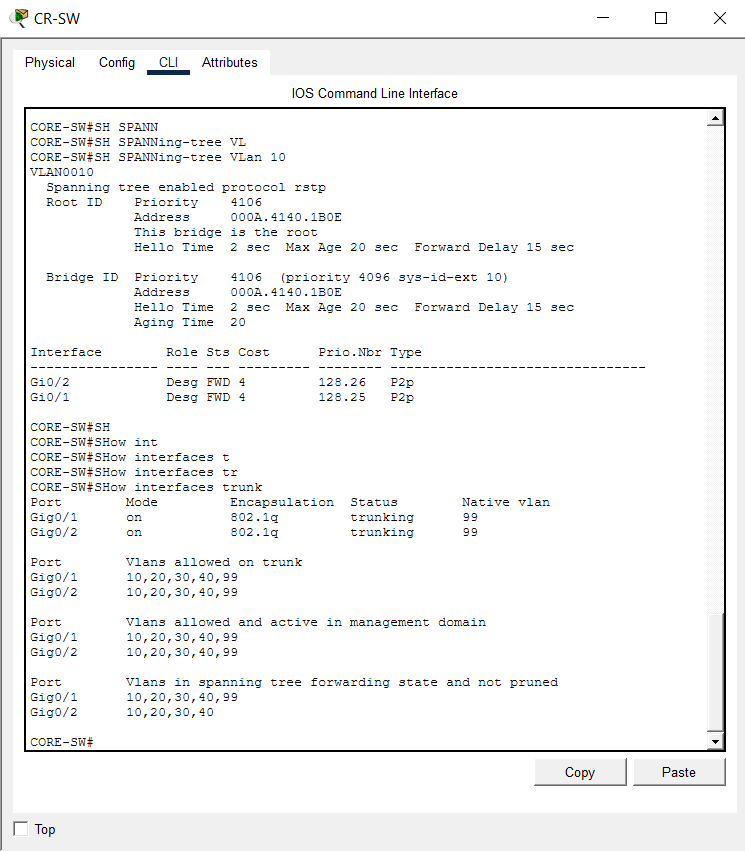
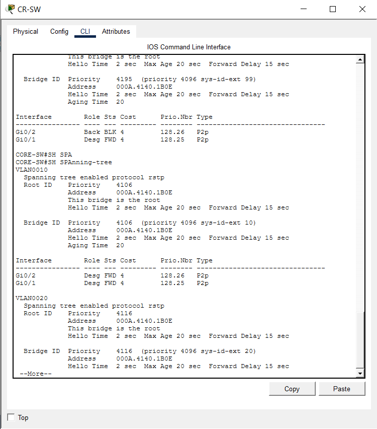
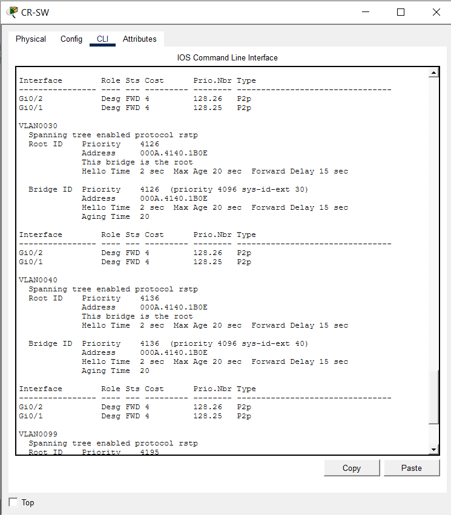
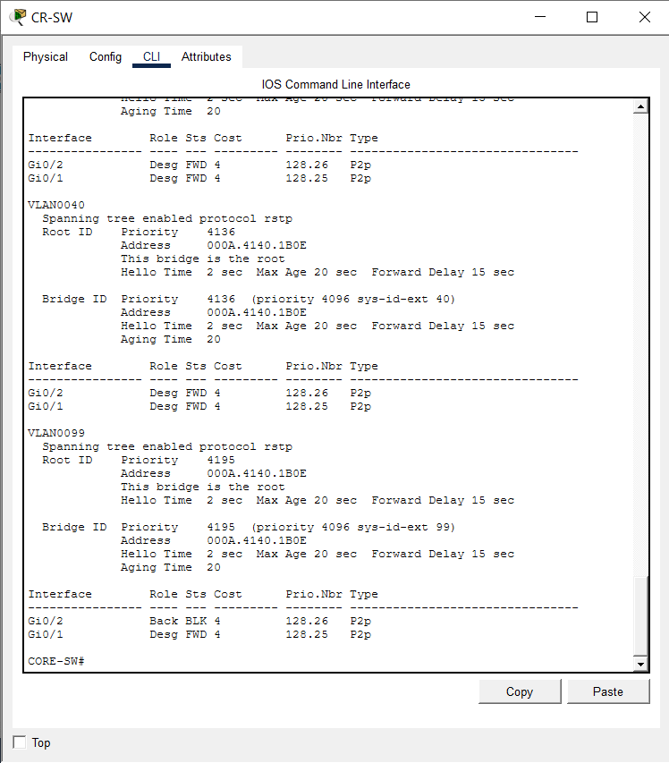
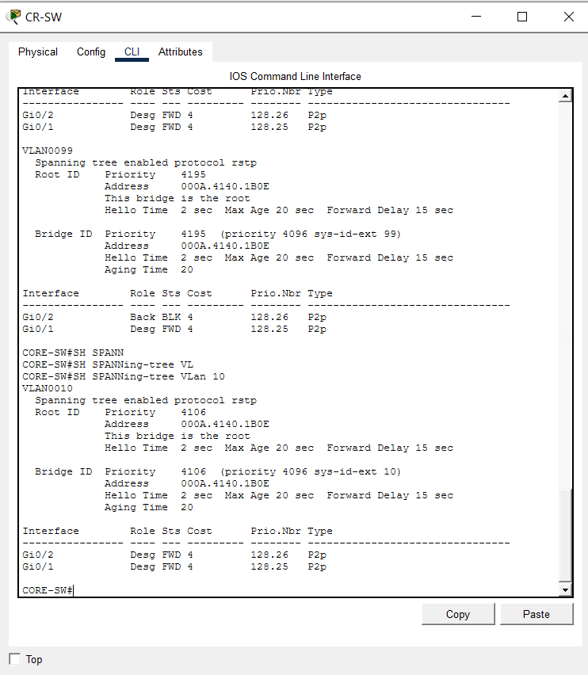

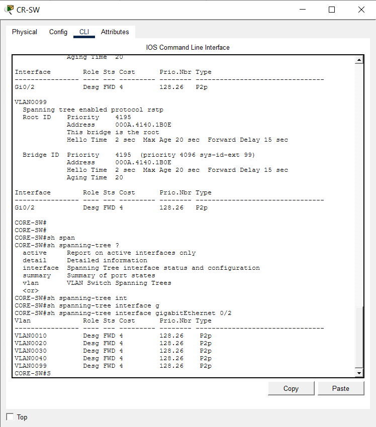

### 5.2 Distribution Switch — DIST-A

📂 **Local Repository Link:** [View Raw DIST-A Script File](./Lab-05-DIST-A-SW-Running-Config.txt)

```cisco
hostname DIST-A
!
vlan 10
 name Voice
!
vlan 20
 name Data
!
vlan 30
 name Management
!
vlan 40
 name Guest
!
vlan 99
 name Native_Trunk
!
spanning-tree mode rapid-pvst
spanning-tree vlan 1,10,20,30,40,99 priority 16384
!
interface range GigabitEthernet0/1 - 2
 description *** Uplinks to CORE-SW and Peer switches ***
 switchport mode trunk
 switchport trunk native vlan 99
 switchport trunk allowed vlan 10,20,30,40,99
 no shutdown
!
end
```

**⚠ Scope note:** No live `show spanning-tree` verification screenshots for `DIST-A` were available for this documentation pass — only its running-configuration export is verified here. Given the Anomaly 1 finding above (Section 4c), obtaining a direct capture from `DIST-A` is a priority follow-up item.

### 5.3 Distribution Switch — DIST-B

📂 **Local Repository Link:** [View Raw DIST-B Script File](./Lab-05-DIST-B-SW-Running-Config.txt)

```cisco
hostname DIST-B
!
vlan 10
 name Voice
!
vlan 20
 name Data
!
vlan 30
 name Management
!
vlan 40
 name Guest
!
vlan 99
 name Native_Trunk
!
spanning-tree mode rapid-pvst
spanning-tree vlan 1,10,20,30,40,99 priority 12288
!
interface range GigabitEthernet0/1 - 2
 description *** Uplinks to CORE-SW and Peer switches ***
 switchport mode trunk
 switchport trunk native vlan 99
 switchport trunk allowed vlan 10,20,30,40,99
 no shutdown
!
end
```

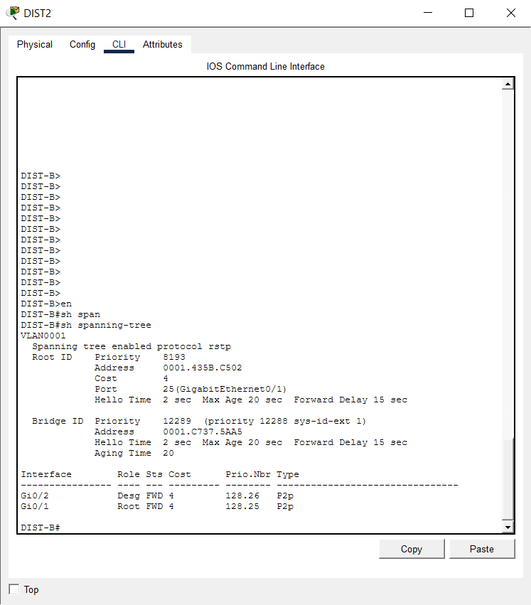
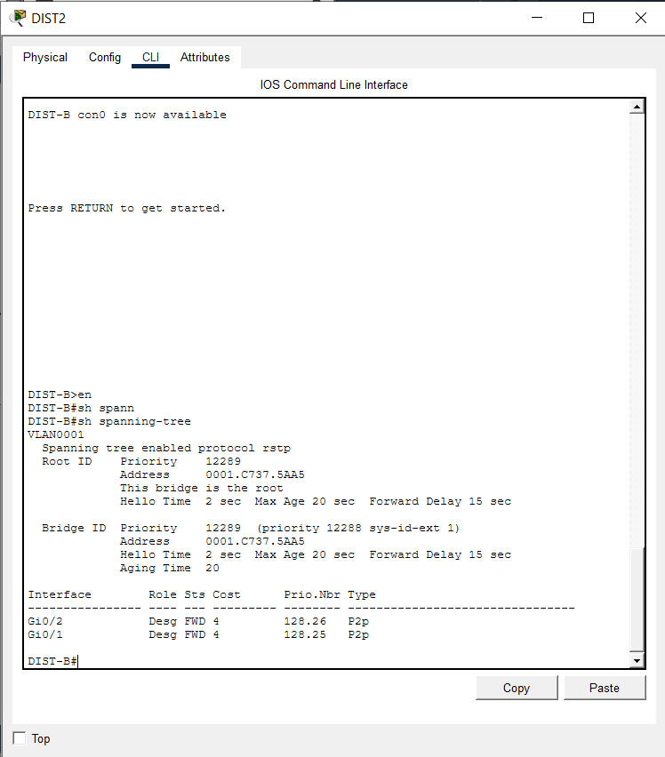
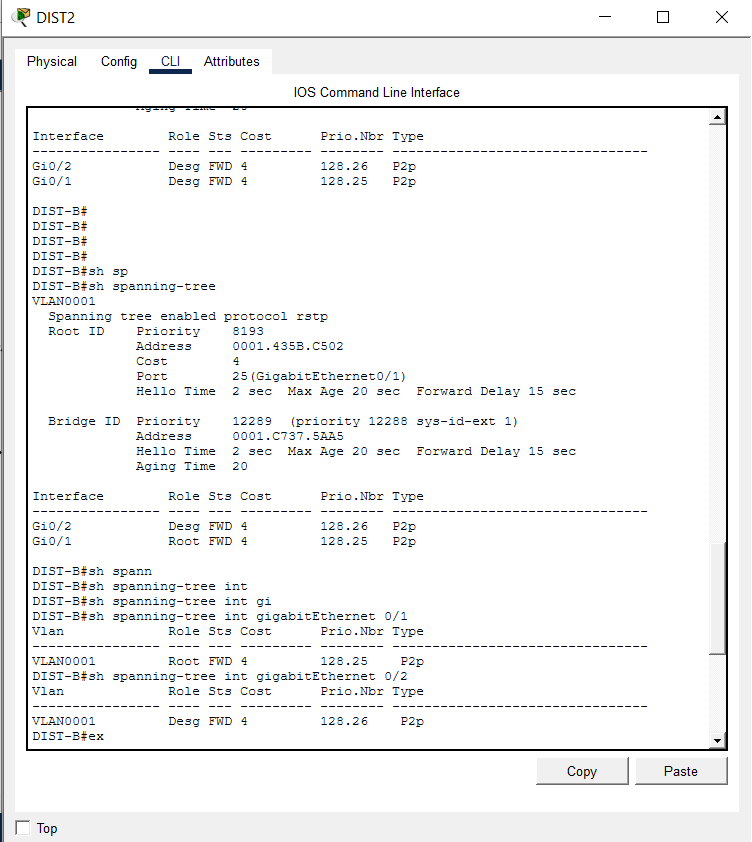

### 5.4 Access Switch — SW-ACCESS

📂 **Local Repository Link:** [View Raw SW-ACCESS Script File](./Lab-05-ACCESS-SW-Running-Config.txt)

```cisco
hostname SW-ACCESS
!
vlan 10
 name Voice
!
vlan 20
 name Data
!
vlan 30
 name Management
!
vlan 40
 name Guest
!
vlan 99
 name Native_Trunk
!
spanning-tree mode rapid-pvst
spanning-tree vlan 1,10,20,30,40,99 priority 28672
!
interface range GigabitEthernet0/1 - 2
 description *** Uplinks to CORE-SW ***
 switchport mode trunk
 switchport trunk native vlan 99
 switchport trunk allowed vlan 10,20,30,40,99
 no shutdown
!
end
```

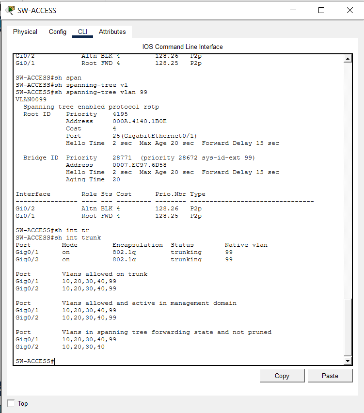
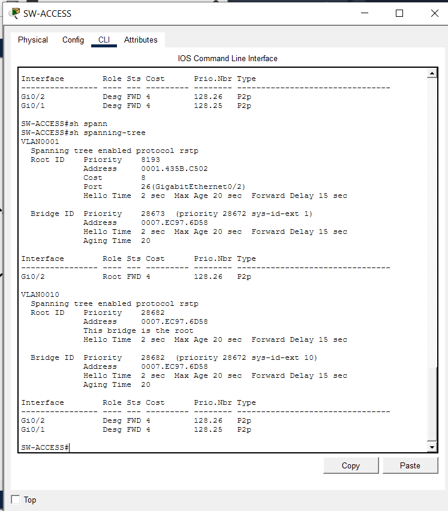

---

## 6. Verification Protocols & Operational Diagnostics

### Test Phase 1: Root Bridge Confirmation Across VLANs

**Objective:** Confirm `CORE-SW` is the elected root bridge for the VLANs where its priority is expected to win.

```text
CORE-SW#sh spanning-tree vlan 10
VLAN0010
  Root ID    Priority    4106
             Address     000A.4140.1B0E
             This bridge is the root
  Bridge ID  Priority    4106  (priority 4096 sys-id-ext 10)
             Address     000A.4140.1B0E

Interface        Role Sts Cost      Prio.Nbr  Type
Gi0/1             Desg FWD 4         128.25    P2p
Gi0/2             Desg FWD 4         128.26    P2p
```

**Analysis:** `CORE-SW` self-confirms as root for VLAN 10 with **both** of its trunk ports in the `Desg`/`FWD` (Designated, Forwarding) role — the expected, healthy state for a root bridge, which by definition has no root port of its own and never blocks. The same pattern (both ports `Desg FWD`, "This bridge is the root") was independently confirmed for VLANs 20, 30, and 40 in the CORE-SW capture set — four of the six configured VLAN instances behaving exactly as designed.

### Test Phase 2: Non-Root Switch Root Port & Path Cost Verification

```text
DIST-B#sh spanning-tree
VLAN0001
  Root ID    Priority    8193
             Address     0001.435B.C502
             Cost        4
             Port        25 (GigabitEthernet0/1)
  Bridge ID  Priority    12289  (priority 12288 sys-id-ext 1)
             Address     0001.C737.5AA5

Interface        Role Sts Cost      Prio.Nbr  Type
Gi0/1             Root FWD 4         128.25    P2p
Gi0/2             Desg FWD 4         128.26    P2p
```

**Analysis:** `DIST-B` correctly identifies itself as non-root, selects `Gi0/1` as its Root Port at a path cost of `4` (a single Gigabit-speed hop), and its own Bridge ID priority (`12289`) correctly reflects its configured base (`12288 + VLAN 1 = 12289`). As documented in Section 4(c) Anomaly 1, the Root ID address here does not match `CORE-SW`'s confirmed bridge address — flagged for direct follow-up verification on `DIST-A`.

### Test Phase 3: Blocking Port (Loop-Prevention) Verification

```text
SW-ACCESS#sh spanning-tree vlan 99
VLAN0099
  Root ID    Priority    4195
             Address     000A.4140.1B0E
             Cost        4
             Port        25 (GigabitEthernet0/1)
  Bridge ID  Priority    28771  (priority 28672 sys-id-ext 99)
             Address     0007.EC97.6D58

Interface        Role Sts Cost      Prio.Nbr  Type
Gi0/1             Root FWD 4         128.25    P2p
Gi0/2             Altn BLK 4         128.26    P2p
```

**Analysis:** This is the definitive proof of successful loop prevention in this topology. `SW-ACCESS` — engineered with the highest (least preferred) priority in the ladder — correctly resolves `Gi0/1` as its Root Port (active, forwarding) toward the confirmed root (`CORE-SW`, address `000A.4140.1B0E`, matching exactly), while `Gi0/2` is placed into the `Altn`/`BLK` (Alternate, Blocking) role. This single blocked port is what converts the four-switch physical ring into a loop-free logical tree — confirmed to sit at exactly the position graph theory predicts (the switch diametrically opposite the root), and using the topologically expected `Alternate` role rather than the anomalous `Backup` role seen at `CORE-SW` for the same VLAN (Section 4c, Anomaly 2).

### Test Phase 4: Trunk Symmetry Verification

```text
CORE-SW#sh interfaces trunk
Port      Mode   Encapsulation  Status      Native vlan
Gig0/1    on     802.1q         trunking    99
Gig0/2    on     802.1q         trunking    99

Port      Vlans allowed on trunk
Gig0/1    10,20,30,40,99
Gig0/2    10,20,30,40,99
```

```text
SW-ACCESS#sh interfaces trunk
Port      Mode   Encapsulation  Status      Native vlan
Gig0/1    on     802.1q         trunking    99
Gig0/2    on     802.1q         trunking    99

Port      Vlans allowed on trunk
Gig0/1    10,20,30,40,99
Gig0/2    10,20,30,40,99

Port      Vlans in spanning tree forwarding state and not pruned
Gig0/1    10,20,30,40,99
Gig0/2    10,20,30,40
```

**Analysis:** The native VLAN (`99`) and allowed-VLAN list (`10,20,30,40,99`) are confirmed identical and symmetric on both ends of the fabric, consistent with the trunk-matching discipline established in Labs 02 and 04. The final line is worth noting explicitly: on `SW-ACCESS`, `Gig0/2`'s "forwarding state and not pruned" list reads `10,20,30,40` — **VLAN 99 is absent** — which is the expected, correct signature of `Gi0/2` being in STP's blocking state specifically for VLAN 99 (consistent with the `Altn BLK` role confirmed in Test Phase 3), while `Gig0/1` correctly forwards all five VLANs including 99 as the active root path.
